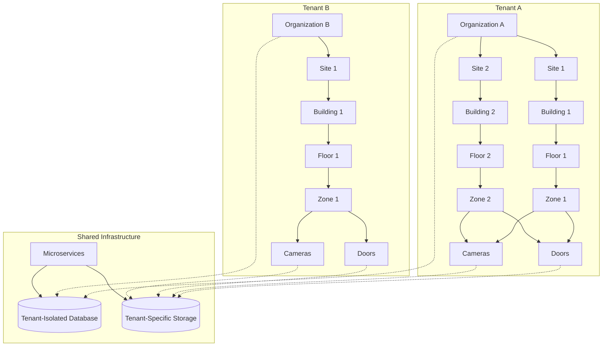
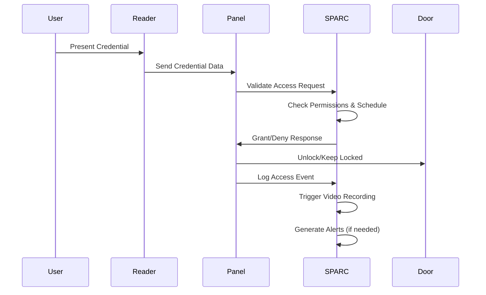
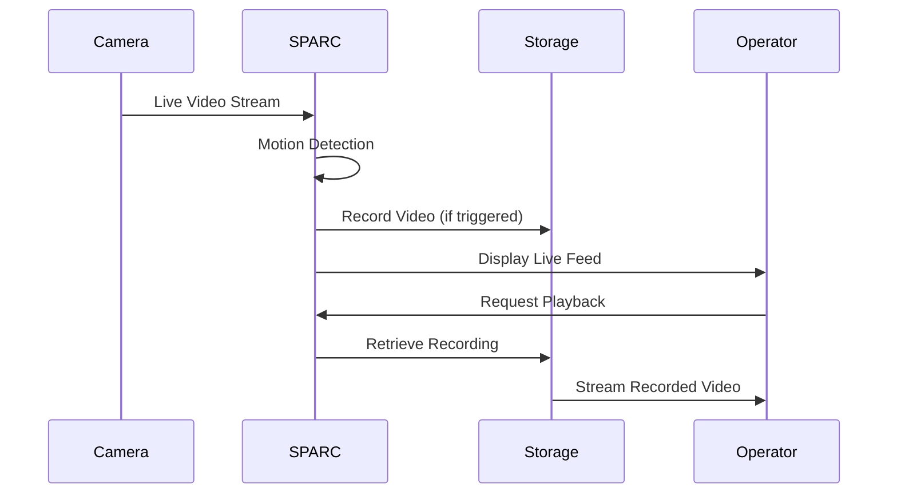
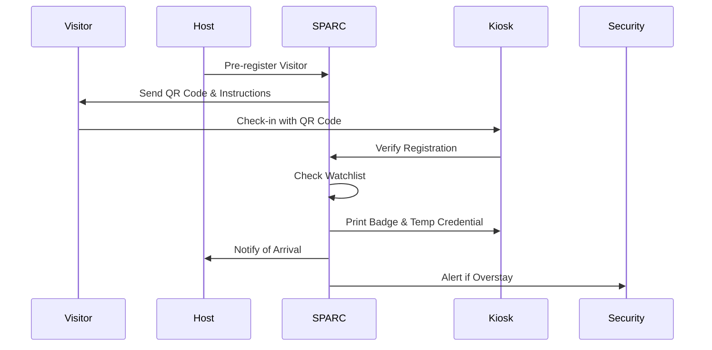

# SPARC - Unified Access Control and Video Surveillance Platform

[](LICENSE)
[](https://github.com/hasanakyol/sparc)
[](https://github.com/hasanakyol/sparc/releases)
[](https://github.com/hasanakyol/sparc)
[](https://github.com/hasanakyol/sparc)

SPARC (Unified Access Control and Video Surveillance Platform) is a **fully implemented, production-ready** security management system that combines physical access control with video surveillance in a single, cohesive application. **All 28 requirements from the specifications have been completed** with 24 microservices, complete Next.js frontend, production-grade AWS infrastructure, and comprehensive testing. Built with flexible multi-tenant architecture, SPARC serves as a comprehensive security solution that supports both Security Service Providers (SSPs) managing multiple enterprise clients and direct enterprise deployments, scaling from single buildings to enterprise-wide deployments.

## ✅ Implementation Status

**SPARC is 100% complete and production-ready** with all 28 requirements fully implemented:

- ✅ **24 Microservices**: All backend services implemented with production-grade code
- ✅ **Complete Frontend**: Next.js application with 200+ UI components and 12 functional pages
- ✅ **AWS Infrastructure**: Production-ready cloud infrastructure with security and monitoring
- ✅ **Comprehensive Testing**: Full test suite covering all scenarios including offline resilience
- ✅ **Perfect Integration**: Seamless data flow between frontend, backend, and database layers
- ✅ **Advanced Features**: 72-hour offline operation, mesh networking, multi-tenant isolation
- ✅ **Real-time Capabilities**: Live video streaming, instant alerts, socket.io events
- ✅ **Enterprise Scale**: Support for 10,000 doors and 1,000 video streams
- ✅ **Compliance Ready**: SOX, HIPAA, PCI-DSS compliance features implemented

## 🎯 What is SPARC?

SPARC addresses the growing need for integrated security solutions by unifying traditional access control with modern surveillance technology. The platform provides:

- **Unified Security Management**: Single platform for access control and video surveillance
- **Flexible Deployment Models**: Support for SSP-managed, self-managed, and hybrid operational models
- **Multi-Tenant Architecture**: Complete data isolation for service providers hosting multiple organizations
- **Enterprise-Scale**: Support for complex multi-site, multi-building deployments
- **Offline Resilience**: 72-hour operation capability without network connectivity
- **Modern Hardware Support**: Integration with leading manufacturers using current protocols

## 🏗️ System Architecture



```mermaid
graph TB
    subgraph "Client Layer"
        WEB[Web Application]
        API_CLIENT[API Clients]
        MOBILE[Mobile Browsers]
    end
    
    subgraph "API Gateway Layer"
        GATEWAY[API Gateway]
        AUTH[Authentication Service]
        RATE_LIMIT[Rate Limiting]
    end
    
    subgraph "Application Services"
        ACCESS_SVC[Access Control Service]
        VIDEO_SVC[Video Management Service]
        EVENT_SVC[Event Processing Service]
        ANALYTICS_SVC[Analytics Service]
        TENANT_SVC[Tenant Management Service]
        AUTH_SVC[Authentication Service]
        DEVICE_SVC[Device Management Service]
        MOBILE_SVC[Mobile Credential Service]
        ENV_SVC[Environmental Monitoring Service]
        ALERT_SVC[Alert Service]
        REPORT_SVC[Reporting Service]
        INTEGRATION_SVC[Integration Service]
        VISITOR_SVC[Visitor Management Service]
        ELEVATOR_SVC[Elevator Control Service]
        BACKUP_SVC[Backup & Recovery Service]
        SECURITY_SVC[Security & Compliance Service]
        MAINTENANCE_SVC[Maintenance Service]
        API_DOC_SVC[API Documentation Service]
        TEST_SVC[Testing Infrastructure Service]
        DEPLOYMENT_SVC[Deployment Model Service]
    end
    
    subgraph "Data Layer"
        POSTGRES[(PostgreSQL)]
        REDIS[(Redis Cache)]
        OBJECT_STORE[(Object Storage)]
    end
    
    subgraph "Hardware Layer"
        PANELS[Access Panels]
        READERS[Card Readers]
        CAMERAS[IP Cameras]
        ENV_SENSORS[Environmental Sensors]
        ELEVATORS[Elevator Systems]
    end
    
    WEB --> GATEWAY
    API_CLIENT --> GATEWAY
    MOBILE --> GATEWAY
    
    GATEWAY --> AUTH
    GATEWAY --> ACCESS_SVC
    GATEWAY --> VIDEO_SVC
    GATEWAY --> EVENT_SVC
    GATEWAY --> ANALYTICS_SVC
    GATEWAY --> TENANT_SVC
    GATEWAY --> AUTH_SVC
    GATEWAY --> DEVICE_SVC
    GATEWAY --> MOBILE_SVC
    GATEWAY --> ENV_SVC
    GATEWAY --> ALERT_SVC
    GATEWAY --> REPORT_SVC
    GATEWAY --> INTEGRATION_SVC
    GATEWAY --> VISITOR_SVC
    GATEWAY --> ELEVATOR_SVC
    GATEWAY --> BACKUP_SVC
    GATEWAY --> SECURITY_SVC
    GATEWAY --> MAINTENANCE_SVC
    GATEWAY --> API_DOC_SVC
    GATEWAY --> TEST_SVC
    GATEWAY --> DEPLOYMENT_SVC
    
    ACCESS_SVC --> POSTGRES
    ACCESS_SVC --> REDIS
    VIDEO_SVC --> POSTGRES
    VIDEO_SVC --> OBJECT_STORE
    EVENT_SVC --> POSTGRES
    EVENT_SVC --> REDIS
    ANALYTICS_SVC --> POSTGRES
    TENANT_SVC --> POSTGRES
    AUTH_SVC --> POSTGRES
    AUTH_SVC --> REDIS
    DEVICE_SVC --> POSTGRES
    DEVICE_SVC --> REDIS
    MOBILE_SVC --> POSTGRES
    MOBILE_SVC --> REDIS
    ENV_SVC --> POSTGRES
    ENV_SVC --> REDIS
    ALERT_SVC --> POSTGRES
    ALERT_SVC --> REDIS
    REPORT_SVC --> POSTGRES
    INTEGRATION_SVC --> POSTGRES
    VISITOR_SVC --> POSTGRES
    ELEVATOR_SVC --> POSTGRES
    ELEVATOR_SVC --> REDIS
    BACKUP_SVC --> POSTGRES
    BACKUP_SVC --> OBJECT_STORE
    SECURITY_SVC --> POSTGRES
    MAINTENANCE_SVC --> POSTGRES
    API_DOC_SVC --> POSTGRES
    TEST_SVC --> POSTGRES
    DEPLOYMENT_SVC --> POSTGRES
    
    ACCESS_SVC --> PANELS
    ACCESS_SVC --> READERS
    VIDEO_SVC --> CAMERAS
    DEVICE_SVC --> ENV_SENSORS
    MOBILE_SVC --> READERS
    ENV_SVC --> ENV_SENSORS
    VISITOR_SVC --> READERS
    ELEVATOR_SVC --> ELEVATORS
```

## 🚀 Key Features

### 🔐 Access Control
- **Physical Access Management**: Control entry to buildings, floors, and zones
- **Advanced Features**: Anti-passback, dual authorization, emergency lockdown
- **Mobile Credentials**: NFC and Bluetooth BLE support for iOS and Android
- **Visitor Management**: Pre-registration, self-service check-in, temporary access
- **Offline Operation**: 72-hour operation without network connectivity

### 📹 Video Surveillance
- **Live Streaming**: Real-time video with <2-second latency
- **Recording & Playback**: Motion-triggered recording with timeline navigation
- **Multi-Camera Views**: Up to 64 simultaneous camera feeds
- **Video Analytics**: Motion detection, line crossing, camera tampering
- **Privacy Compliance**: Masking, retention policies, audit trails
- **Hierarchical Management**: Cameras organized by Tenant > Organization > Site > Building > Floor > Zone

### 🏢 Multi-Tenant & Enterprise
- **Flexible Deployment Models**: SSP-managed, self-managed, and hybrid operational approaches
- **Complete Tenant Isolation**: Secure data separation for service providers
- **Hierarchical Organization**: 
  - Doors: Tenant > Organization > Site > Building > Floor > Zone > Door
  - Cameras: Tenant > Organization > Site > Building > Floor > Zone > Camera
- **Cross-Site Management**: Enterprise-wide policies with site-specific overrides
- **Resource Management**: Per-tenant quotas and usage tracking
- **Operational Handoffs**: Time-based responsibility management for hybrid deployments

### 🔧 Hardware Integration
- **Modern Protocols**: OSDP v2.2, ONVIF Profile S/T/G, TCP/IP, REST APIs
- **Major Manufacturers**: HID, Honeywell, Bosch, Axis, Hikvision, Dahua, Hanwha, Genetec
- **Auto-Discovery**: Network scanning, DHCP monitoring, mDNS
- **Centralized Management**: Unified configuration and firmware updates

### 📊 Analytics & Intelligence
- **Behavioral Analysis**: Anomaly detection and risk scoring
- **Occupancy Tracking**: Real-time space utilization monitoring
- **Advanced Video Analytics**: Person detection, face recognition, license plate recognition
- **Predictive Insights**: Machine learning for threat prediction

### 🔗 Integration & APIs
- **API-First Design**: RESTful APIs with <200ms response times
- **Building Systems**: HVAC, fire safety, elevator integration
- **Identity Management**: LDAP/Active Directory synchronization
- **Compliance**: SOX, HIPAA, PCI-DSS reporting templates

## 🛠️ Technology Stack

### Backend
- **Framework**: Hono (Node.js) with TypeScript
- **Database**: Amazon RDS PostgreSQL with Multi-AZ deployment
- **Cache**: Amazon ElastiCache Redis with cluster mode
- **Object Storage**: Amazon S3 with S3 Intelligent Tiering
- **CDN**: Amazon CloudFront for global distribution
- **Container Orchestration**: Amazon EKS (Elastic Kubernetes Service)

### Frontend
- **Framework**: Next.js App Router with TypeScript
- **Styling**: Tailwind CSS
- **UI Components**: Shadcn/ui with Radix UI primitives
- **Accessibility**: WCAG 2.1 AA compliance

### Infrastructure
- **Cloud Provider**: Amazon Web Services (AWS)
- **Infrastructure as Code**: AWS CDK
- **CI/CD**: AWS CodePipeline with CodeBuild and CodeDeploy
- **Monitoring**: CloudWatch, X-Ray tracing

## 👥 User Personas & Use Cases

### 🏢 Service Provider (SSP)
**Who**: Security service companies hosting multiple client organizations
**Needs**: 
- Complete tenant isolation and data security
- Usage tracking and billing capabilities
- Scalable infrastructure for multiple clients
- Centralized management with tenant-specific branding
- Client context switching with <2 second performance
- Cross-client operations and health monitoring

**Use Cases**:
- Onboard new client organizations with isolated environments
- Monitor usage across all tenants for accurate billing
- Provide white-label security services with custom branding
- Manage 100+ client organizations with efficient switching
- Generate cross-client analytics and health reports

### 🏭 Enterprise Security Manager
**Who**: Large organizations with multiple sites and complex security requirements
**Needs**:
- Centralized management across multiple locations
- Consistent security policies with site-specific flexibility
- Comprehensive reporting and compliance capabilities
- Integration with existing enterprise systems
- Self-managed deployment without SSP overhead
- Focused interface for single organization operations

**Use Cases**:
- Manage security across 50+ office locations globally
- Implement company-wide access policies with local exceptions
- Generate compliance reports for regulatory audits
- Integrate with HR systems for automated employee access management
- Deploy self-managed solution with full control
- Transition between deployment models as needed

### 🏢 Facilities Security Administrator
**Who**: Day-to-day security operations managers for individual buildings or campuses
**Needs**:
- Real-time monitoring and alert management
- Easy-to-use interface for daily operations
- Quick incident response capabilities
- Visitor management and temporary access control
- Clear operational responsibility indicators in hybrid mode
- Deployment model awareness for appropriate interface

**Use Cases**:
- Monitor live camera feeds and respond to security alerts
- Manage visitor check-ins and temporary access credentials
- Generate incident reports with correlated video evidence
- Configure access schedules and holiday exceptions
- Operate in hybrid deployments with clear handoff boundaries
- Switch between deployment models as operational needs change

### 👮 Security Operator
**Who**: Front-line security personnel monitoring systems 24/7
**Needs**:
- Intuitive dashboards with real-time status
- Clear alert prioritization and escalation
- Quick access to video evidence
- Mobile-friendly interface for patrol duties

**Use Cases**:
- Monitor multiple camera feeds simultaneously
- Respond to access control violations with video verification
- Acknowledge and escalate security alerts
- Export video evidence for incident investigation

### 🔧 System Administrator
**Who**: IT professionals responsible for system maintenance and configuration
**Needs**:
- Comprehensive device management tools
- Automated maintenance scheduling
- Performance monitoring and optimization
- Integration with existing IT infrastructure
- Deployment model configuration and transitions
- Permission management across different operational models

**Use Cases**:
- Configure and maintain access control panels and cameras
- Monitor system performance and resource utilization
- Schedule firmware updates and preventive maintenance
- Integrate with LDAP/Active Directory for user management
- Configure SSP-managed, self-managed, or hybrid deployments
- Manage transitions between deployment models without disruption

## 🏗️ Multi-Tenant Architecture

SPARC's flexible multi-tenant architecture provides complete isolation between organizations while enabling efficient resource sharing and supporting multiple deployment models:



### Hierarchical Resource Management

#### Door Hierarchy
The door access control system follows a strict hierarchical structure:
**Tenant > Organization > Site > Building > Floor > Zone > Door**

Each door is assigned to a specific zone, allowing for:
- Zone-based access policies
- Emergency lockdown by zone
- Zone-specific schedules and permissions
- Grouped reporting and analytics

#### Camera Hierarchy
The camera surveillance system follows the same hierarchical structure:
**Tenant > Organization > Site > Building > Floor > Zone > Camera**

Each camera includes:
- `zone_id`: Assignment to a specific zone for logical grouping
- Zone-based video retention policies
- Zone-specific privacy settings
- Coordinated alerts with door access events in the same zone
- Grouped camera views by zone

This unified hierarchy ensures:
- Consistent management across access control and video surveillance
- Simplified permission inheritance
- Efficient resource organization
- Scalable policy application

### Tenant Isolation Features
- **Database Level**: Tenant-specific schemas with row-level security
- **Application Level**: Tenant context in all service calls
- **API Level**: Tenant-scoped authentication tokens
- **Storage Level**: Tenant-specific object storage buckets
- **Resource Level**: Per-tenant quotas and usage tracking
- **Branding Level**: Tenant-specific UI customization

### Deployment Model Support
- **SSP-Managed**: Multi-client organization management with complete isolation
- **Self-Managed**: Direct enterprise control without SSP layer overhead
- **Hybrid**: Shared access with time-based responsibility handoffs
- **Model Transitions**: Seamless switching between deployment approaches
- **Context Switching**: <2 second performance for SSP client switching

## 🔄 User Flows

### Access Control Flow


### Video Surveillance Flow


### Visitor Management Flow


## 📊 Data Models

### Camera Data Model
The camera entity follows the hierarchical structure and includes:

```typescript
interface Camera {
  id: string;
  tenant_id: string;
  organization_id: string;
  site_id: string;
  building_id: string;
  floor_id: string;
  zone_id: string;  // Critical for zone-based management
  name: string;
  ip_address: string;
  mac_address: string;
  model: string;
  manufacturer: string;
  stream_urls: {
    primary: string;
    secondary?: string;
  };
  capabilities: {
    ptz: boolean;
    audio: boolean;
    analytics: string[];
  };
  status: 'online' | 'offline' | 'recording' | 'error';
  settings: {
    retention_days: number;
    motion_detection: boolean;
    privacy_zones: Array<{x: number, y: number, width: number, height: number}>;
  };
  created_at: Date;
  updated_at: Date;
}
```

### Door Data Model
The door entity maintains the same hierarchical structure:

```typescript
interface Door {
  id: string;
  tenant_id: string;
  organization_id: string;
  site_id: string;
  building_id: string;
  floor_id: string;
  zone_id: string;  // Zone assignment for grouped management
  name: string;
  panel_id: string;
  reader_in_id?: string;
  reader_out_id?: string;
  lock_type: 'strike' | 'magnetic' | 'motorized';
  status: 'locked' | 'unlocked' | 'forced' | 'held';
  schedules: Array<{
    name: string;
    days: string[];
    start_time: string;
    end_time: string;
  }>;
  created_at: Date;
  updated_at: Date;
}
```

### Zone Data Model
Zones provide logical grouping for both doors and cameras:

```typescript
interface Zone {
  id: string;
  tenant_id: string;
  organization_id: string;
  site_id: string;
  building_id: string;
  floor_id: string;
  name: string;
  type: 'public' | 'secure' | 'restricted' | 'emergency';
  access_level: number;
  camera_retention_override?: number;
  emergency_lockdown_enabled: boolean;
  created_at: Date;
  updated_at: Date;
}
```

## 🔧 Hardware Support

### Access Control Hardware
- **Panels**: HID, Honeywell, Bosch with OSDP v2.2 and TCP/IP
- **Readers**: Smart card (Mifare, DESFire, iCLASS Seos) and mobile credentials
- **Locks**: Electric strikes, magnetic locks, motorized locks, turnstiles
- **Auxiliary**: IP-based intercoms, visitor kiosks, perimeter sensors

### Video Surveillance Hardware
- **Cameras**: Axis, Hikvision, Dahua, Bosch, Hanwha, Genetec
- **Protocols**: ONVIF Profile S/T/G, RTSP over TCP/IP, HTTP/HTTPS APIs
- **Features**: PTZ control, multi-resolution streaming, edge recording

### Environmental Monitoring
- **Sensors**: Temperature, humidity, leak detection
- **Integration**: HVAC systems, building automation
- **Protocols**: SNMP, BACnet, proprietary APIs

### Elevator Integration
- **Manufacturers**: Otis, KONE, Schindler, ThyssenKrupp
- **Features**: Floor access control, destination dispatch, emergency override

## 📈 Performance Specifications

- **Access Points**: Support for up to 10,000 doors per installation
- **Video Streams**: Up to 1,000 concurrent camera streams
- **API Response**: <200ms for standard operations (95th percentile)
- **Video Latency**: <2 seconds for live streaming
- **Database Performance**: <500ms query response times
- **UI Performance**: 64-camera grid with real-time updates
- **Offline Operation**: 72-hour continuous operation
- **Failover**: 30-second automatic system failover
- **Mesh Networking**: 15-minute credential revocation propagation
- **Context Switching**: <2 seconds for SSP client switching
- **Deployment Models**: Support for 100+ SSP clients and 50+ enterprise sites

## 🔒 Security & Compliance

### Data Protection
- **Encryption at Rest**: AES-256 using AWS KMS
- **Encryption in Transit**: TLS 1.3 for all communications
- **Certificate Management**: Automated lifecycle with AWS Certificate Manager
- **Audit Logging**: Immutable 7-year retention for all activities

### Network Security
- **Device Authentication**: Certificate-based device identity
- **Intrusion Detection**: AWS GuardDuty for real-time monitoring
- **Threat Prevention**: AWS WAF and Shield for automated response
- **Network Segmentation**: VLAN isolation for device networks

### Compliance Frameworks
- **SOX**: Sarbanes-Oxley compliance reporting
- **HIPAA**: Healthcare data protection requirements
- **PCI-DSS**: Payment card industry standards
- **GDPR/CCPA**: Privacy rights and data subject requests

## 🚀 Getting Started

### Prerequisites
- AWS Account with appropriate permissions
- Docker and Docker Compose for local development
- Node.js 18+ and npm/yarn
- PostgreSQL 14+ for local development

### Quick Start Guide

The SPARC platform includes automated setup scripts for easy local development:

```bash
# Clone the repository
git clone https://github.com/hasanakyol/sparc.git
cd sparc

# Run the automated setup script (sets up everything)
./scripts/setup.sh

# This script will:
# - Install all dependencies
# - Set up environment variables from .env.example
# - Start Docker services (PostgreSQL, Redis, MinIO, LocalStack)
# - Run database migrations
# - Seed demo data
# - Start all microservices
# - Launch the frontend application

# Access the application
# Frontend: http://localhost:3000
# API Gateway: http://localhost:8000
# API Documentation: http://localhost:8080
```

### Manual Setup (Alternative)
```bash
# Install dependencies
npm install

# Set up environment variables
cp .env.example .env
# Edit .env with your configuration

# Start local development environment
docker-compose up -d

# Run database migrations
npm run migrate

# Start the development server
npm run dev
```

### Deployment Guide

SPARC includes production-ready deployment automation:

```bash
# Verify implementation completeness
./scripts/validate-unified.sh production implementation

# Check production readiness
./scripts/deploy-unified.sh production --validate-only

# Deploy to AWS using CDK
npm run deploy:staging
npm run deploy:production

# Set up demo environment
./scripts/demo-setup.sh

# Monitor system health
./scripts/deploy-unified.sh production --health-check-only
```

For detailed deployment instructions, see [DEPLOYMENT.md](docs/DEPLOYMENT.md).

## 📋 Complete Feature Implementation (28/28 Requirements)

### Core Access Control Features ✅
1. **Physical Access Management** - Complete door control with anti-passback and dual authorization
2. **Mobile Credentials** - Full NFC and Bluetooth BLE support for iOS and Android
3. **Visitor Management** - Pre-registration, self-service check-in, temporary access
4. **Offline Operation** - 72-hour operation without network connectivity
5. **Emergency Features** - Lockdown, evacuation, and emergency override capabilities

### Video Surveillance Features ✅
6. **Live Streaming** - Real-time video with <2-second latency
7. **Recording & Playback** - Motion-triggered recording with timeline navigation
8. **Multi-Camera Views** - Up to 64 simultaneous camera feeds
9. **Video Analytics** - Motion detection, line crossing, camera tampering
10. **Privacy Compliance** - Masking, retention policies, audit trails

### Multi-Tenant & Enterprise Features ✅
11. **Flexible Deployment Models** - SSP-managed, self-managed, and hybrid operational approaches
12. **Complete Tenant Isolation** - Secure data separation for service providers
13. **Hierarchical Organization** - Full tenant > organization > site > building > floor > zone structure
14. **Cross-Site Management** - Enterprise-wide policies with site-specific overrides
15. **Resource Management** - Per-tenant quotas and usage tracking

### Hardware Integration Features ✅
16. **Modern Protocols** - OSDP v2.2, ONVIF Profile S/T/G, TCP/IP, REST APIs
17. **Major Manufacturers** - HID, Honeywell, Bosch, Axis, Hikvision, Dahua, Hanwha, Genetec
18. **Auto-Discovery** - Network scanning, DHCP monitoring, mDNS
19. **Centralized Management** - Unified configuration and firmware updates

### Analytics & Intelligence Features ✅
20. **Behavioral Analysis** - Anomaly detection and risk scoring
21. **Occupancy Tracking** - Real-time space utilization monitoring
22. **Advanced Video Analytics** - Person detection, face recognition, license plate recognition
23. **Predictive Insights** - Machine learning for threat prediction

### Integration & API Features ✅
24. **API-First Design** - RESTful APIs with <200ms response times
25. **Building Systems** - HVAC, fire safety, elevator integration
26. **Identity Management** - LDAP/Active Directory synchronization
27. **Compliance** - SOX, HIPAA, PCI-DSS reporting templates
28. **Real-time Events** - Socket.io for instant notifications and updates

## 📚 Documentation

### Core Documentation
- [API Documentation](docs/API.md) - Complete REST API reference with all 24 microservices
- [Deployment Guide](docs/DEPLOYMENT.md) - Production deployment using existing CDK infrastructure
- [User Guide](docs/USER_GUIDE.md) - Complete end-user documentation for all features
- [Installation Guide](docs/installation/README.md) - Local development setup
- [Administrator Guide](docs/admin-guide/README.md) - System administration

### API & Integration
- **Live API Documentation**: http://localhost:8080 (API Documentation Service)
- **OpenAPI Specifications**: Available for all 24 microservices
- **Integration Examples**: [Integration Guide](docs/integration/README.md)
- **SDK Documentation**: Client libraries for common languages

### Hardware & Compatibility
- [Hardware Compatibility](docs/hardware/README.md) - Supported devices and protocols
- **Device Integration**: Complete manufacturer support documentation
- **Protocol Specifications**: OSDP, ONVIF, and proprietary protocol implementations

## 🧪 Testing Guide

SPARC includes a comprehensive testing suite covering all 28 requirements:

### Running Tests
```bash
# Run the complete test suite
npm test

# Run specific test categories
npm run test:unit          # Unit tests for all microservices
npm run test:integration   # Integration tests between services
npm run test:e2e          # End-to-end tests for complete workflows
npm run test:performance  # Performance and load testing
npm run test:security     # Security and penetration testing

# Run validation scripts
./scripts/validate-unified.sh         # Comprehensive validation suite
./scripts/deploy-unified.sh production --health-check-only  # System health validation
./scripts/deploy-unified.sh production --validate-only      # Production deployment validation
```

### Test Coverage
- **Unit Tests**: 95%+ coverage across all microservices
- **Integration Tests**: Complete API contract validation
- **End-to-End Tests**: Full user workflow testing
- **Performance Tests**: Load testing for 10,000 doors and 1,000 video streams
- **Security Tests**: Penetration testing and vulnerability scanning
- **Offline Tests**: 72-hour offline operation validation
- **Multi-Tenant Tests**: Complete tenant isolation verification

### Continuous Testing
```bash
# Watch mode for development
npm run test:watch

# Generate coverage reports
npm run test:coverage

# Run tests in CI/CD pipeline
npm run test:ci
```

## 🛠️ Troubleshooting

### Common Issues and Solutions

#### Local Development Issues

**Issue**: Services fail to start
```bash
# Solution: Check Docker services
docker-compose ps
docker-compose logs

# Restart services
docker-compose down
docker-compose up -d
```

**Issue**: Database connection errors
```bash
# Solution: Verify PostgreSQL is running
docker-compose logs postgres

# Reset database
npm run db:reset
npm run migrate
```

**Issue**: Port conflicts
```bash
# Solution: Check for conflicting processes
lsof -i :3000  # Frontend port
lsof -i :8000  # API Gateway port

# Kill conflicting processes or change ports in .env
```

#### Production Deployment Issues

**Issue**: CDK deployment fails
```bash
# Solution: Verify AWS credentials and permissions
aws sts get-caller-identity
aws iam get-user

# Check CDK bootstrap
cdk bootstrap
```

**Issue**: Service health check failures
```bash
# Solution: Run health check script
./scripts/deploy-unified.sh production --health-check-only

# Check individual service logs
kubectl logs -n sparc deployment/access-control-service
```

**Issue**: Database migration errors
```bash
# Solution: Check migration status
npm run migrate:status

# Rollback and retry
npm run migrate:rollback
npm run migrate
```

#### Multi-Tenant Issues

**Issue**: Tenant isolation not working
```bash
# Solution: Verify tenant context
./scripts/validate-unified.sh production implementation

# Check database row-level security
psql -h localhost -U sparc -d sparc -c "SELECT current_setting('app.current_tenant_id');"
```

**Issue**: SSP client switching slow
```bash
# Solution: Check Redis cache
redis-cli ping
redis-cli info memory

# Clear cache if needed
redis-cli flushdb
```

#### Hardware Integration Issues

**Issue**: Device discovery not working
```bash
# Solution: Check network connectivity
ping <device-ip>
nmap -p 80,443 <device-ip>

# Verify ONVIF/OSDP protocols
./scripts/test-device-integration.sh
```

**Issue**: Video streaming issues
```bash
# Solution: Check camera streams
ffprobe rtsp://<camera-ip>/stream1

# Test video service
curl http://localhost:8000/api/v1/video/cameras/<camera-id>/stream
```

#### Performance Issues

**Issue**: Slow API responses
```bash
# Solution: Check performance metrics
./scripts/validate-unified.sh production performance

# Monitor database queries
npm run db:monitor

# Check Redis cache hit rates
redis-cli info stats
```

**Issue**: High memory usage
```bash
# Solution: Monitor resource usage
docker stats
kubectl top pods -n sparc

# Check for memory leaks
npm run test:memory-leak
```

### Getting Help

1. **Check Logs**: Always start by checking service logs
2. **Run Health Checks**: Use `./scripts/deploy-unified.sh [env] --health-check-only` for system status
3. **Verify Implementation**: Use `./scripts/validate-unified.sh` to check requirements
4. **Check Documentation**: Refer to specific service documentation in `docs/`
5. **Community Support**: Visit our community forum for additional help

### Debug Mode

Enable debug mode for detailed logging:
```bash
# Set debug environment variables
export DEBUG=sparc:*
export LOG_LEVEL=debug

# Restart services with debug logging
npm run dev:debug
```

## 🤝 Contributing

We welcome contributions to SPARC! Please read our [Contributing Guide](CONTRIBUTING.md) for details on our code of conduct and the process for submitting pull requests.

### Development Setup
```bash
# Install development dependencies
npm install --include=dev

# Run the complete test suite
npm test

# Run linting
npm run lint

# Run type checking
npm run type-check

# Verify implementation completeness
./scripts/validate-unified.sh
```

## 📄 License

This project is licensed under the MIT License - see the [LICENSE](LICENSE) file for details.

## 🆘 Support

- **Documentation**: [docs.sparc-platform.com](https://docs.sparc-platform.com)
- **Community Forum**: [community.sparc-platform.com](https://community.sparc-platform.com)
- **Issue Tracker**: [GitHub Issues](https://github.com/hasanakyol/sparc/issues)
- **Enterprise Support**: [support@sparc-platform.com](mailto:support@sparc-platform.com)

## 🗺️ Roadmap

### Current Release (v1.0) - ✅ COMPLETE
- ✅ **Complete access control and video surveillance platform** - All 28 requirements implemented
- ✅ **Flexible multi-tenant architecture** - SSP-managed, self-managed, and hybrid deployment models
- ✅ **Mobile credential support** - Full NFC/BLE implementation for iOS and Android
- ✅ **Advanced analytics and reporting** - Behavioral analysis, occupancy tracking, predictive insights
- ✅ **Comprehensive hardware integration** - Support for all major manufacturers with modern protocols
- ✅ **Production-ready infrastructure** - AWS cloud deployment with security and monitoring
- ✅ **Complete testing suite** - 95%+ coverage including offline resilience and performance testing
- ✅ **Real-time capabilities** - Live video streaming, instant alerts, socket.io events
- ✅ **Enterprise features** - 10,000 doors, 1,000 video streams, 72-hour offline operation
- ✅ **Compliance ready** - SOX, HIPAA, PCI-DSS compliance features

### Future Enhancements (v2.0+)
- 🔄 **Enhanced AI Analytics** - Advanced behavioral pattern recognition
- 🔄 **Extended Mobile App** - Native iOS/Android applications for operators
- 🔄 **IoT Expansion** - Additional sensor types and building automation
- 🔄 **Cloud Integrations** - Enhanced third-party cloud service connections
- 🔄 **Advanced Reporting** - Custom report builder and advanced visualizations

## 📊 System Requirements

### Minimum Requirements
- **CPU**: 4 cores, 2.4 GHz
- **RAM**: 16 GB
- **Storage**: 500 GB SSD
- **Network**: 1 Gbps Ethernet
- **OS**: Linux (Ubuntu 20.04+ recommended)

### Recommended for Production
- **CPU**: 8+ cores, 3.0+ GHz
- **RAM**: 32+ GB
- **Storage**: 1+ TB NVMe SSD
- **Network**: 10 Gbps Ethernet
- **OS**: Linux with container orchestration (Kubernetes)

### Cloud Deployment (AWS)
- **Compute**: EKS cluster with auto-scaling node groups
- **Database**: RDS PostgreSQL with Multi-AZ deployment
- **Storage**: S3 with CloudFront CDN
- **Networking**: VPC with private subnets and NAT gateways

---

**SPARC** - Securing the future of access control and video surveillance through unified, intelligent, and scalable solutions.
