# SPARC - Unified Access Control and Video Surveillance Platform

[](LICENSE)
[](https://github.com/hasanakyol/sparc)
[](https://github.com/hasanakyol/sparc/releases)

SPARC (Unified Access Control and Video Surveillance Platform) is a comprehensive security management system designed to combine physical access control with video surveillance in a single, cohesive application. Built with flexible multi-tenant architecture, SPARC serves as a security solution that supports both Security Service Providers (SSPs) managing multiple enterprise clients and direct enterprise deployments, scaling from single buildings to enterprise-wide deployments.

## 🎯 What is SPARC?

SPARC addresses the growing need for integrated security solutions by unifying traditional access control with modern surveillance technology. The platform provides:

- **Unified Security Management**: Single platform for access control and video surveillance
- **Flexible Deployment Models**: Support for SSP-managed, self-managed, and hybrid operational models
- **Multi-Tenant Architecture**: Complete data isolation for service providers hosting multiple organizations
- **Enterprise-Scale**: Support for complex multi-site, multi-building deployments
- **Offline Resilience**: 72-hour operation capability without network connectivity
- **Modern Hardware Support**: Integration with leading manufacturers using current protocols

## 🏗️ System Architecture



```mermaid
graph TB
    subgraph "Client Layer"
        WEB[Web Application]
        API_CLIENT[API Clients]
        MOBILE[Mobile Browsers]
    end
    
    subgraph "API Gateway Layer"
        GATEWAY[API Gateway]
        AUTH[Authentication Service]
        RATE_LIMIT[Rate Limiting]
    end
    
    subgraph "Application Services"
        ACCESS_SVC[Access Control Service]
        VIDEO_SVC[Video Management Service]
        EVENT_SVC[Event Processing Service]
        ANALYTICS_SVC[Analytics Service]
        TENANT_SVC[Tenant Management Service]
        AUTH_SVC[Authentication Service]
        DEVICE_SVC[Device Management Service]
        MOBILE_SVC[Mobile Credential Service]
        ENV_SVC[Environmental Monitoring Service]
        ALERT_SVC[Alert Service]
        REPORT_SVC[Reporting Service]
        INTEGRATION_SVC[Integration Service]
        VISITOR_SVC[Visitor Management Service]
        ELEVATOR_SVC[Elevator Control Service]
        BACKUP_SVC[Backup & Recovery Service]
        SECURITY_SVC[Security & Compliance Service]
        MAINTENANCE_SVC[Maintenance Service]
        API_DOC_SVC[API Documentation Service]
        TEST_SVC[Testing Infrastructure Service]
        DEPLOYMENT_SVC[Deployment Model Service]
    end
    
    subgraph "Data Layer"
        POSTGRES[(PostgreSQL)]
        REDIS[(Redis Cache)]
        OBJECT_STORE[(Object Storage)]
    end
    
    subgraph "Hardware Layer"
        PANELS[Access Panels]
        READERS[Card Readers]
        CAMERAS[IP Cameras]
        ENV_SENSORS[Environmental Sensors]
        ELEVATORS[Elevator Systems]
    end
    
    WEB --> GATEWAY
    API_CLIENT --> GATEWAY
    MOBILE --> GATEWAY
    
    GATEWAY --> AUTH
    GATEWAY --> ACCESS_SVC
    GATEWAY --> VIDEO_SVC
    GATEWAY --> EVENT_SVC
    GATEWAY --> ANALYTICS_SVC
    GATEWAY --> TENANT_SVC
    GATEWAY --> AUTH_SVC
    GATEWAY --> DEVICE_SVC
    GATEWAY --> MOBILE_SVC
    GATEWAY --> ENV_SVC
    GATEWAY --> ALERT_SVC
    GATEWAY --> REPORT_SVC
    GATEWAY --> INTEGRATION_SVC
    GATEWAY --> VISITOR_SVC
    GATEWAY --> ELEVATOR_SVC
    GATEWAY --> BACKUP_SVC
    GATEWAY --> SECURITY_SVC
    GATEWAY --> MAINTENANCE_SVC
    GATEWAY --> API_DOC_SVC
    GATEWAY --> TEST_SVC
    GATEWAY --> DEPLOYMENT_SVC
    
    ACCESS_SVC --> POSTGRES
    ACCESS_SVC --> REDIS
    VIDEO_SVC --> POSTGRES
    VIDEO_SVC --> OBJECT_STORE
    EVENT_SVC --> POSTGRES
    EVENT_SVC --> REDIS
    ANALYTICS_SVC --> POSTGRES
    TENANT_SVC --> POSTGRES
    AUTH_SVC --> POSTGRES
    AUTH_SVC --> REDIS
    DEVICE_SVC --> POSTGRES
    DEVICE_SVC --> REDIS
    MOBILE_SVC --> POSTGRES
    MOBILE_SVC --> REDIS
    ENV_SVC --> POSTGRES
    ENV_SVC --> REDIS
    ALERT_SVC --> POSTGRES
    ALERT_SVC --> REDIS
    REPORT_SVC --> POSTGRES
    INTEGRATION_SVC --> POSTGRES
    VISITOR_SVC --> POSTGRES
    ELEVATOR_SVC --> POSTGRES
    ELEVATOR_SVC --> REDIS
    BACKUP_SVC --> POSTGRES
    BACKUP_SVC --> OBJECT_STORE
    SECURITY_SVC --> POSTGRES
    MAINTENANCE_SVC --> POSTGRES
    API_DOC_SVC --> POSTGRES
    TEST_SVC --> POSTGRES
    DEPLOYMENT_SVC --> POSTGRES
    
    ACCESS_SVC --> PANELS
    ACCESS_SVC --> READERS
    VIDEO_SVC --> CAMERAS
    DEVICE_SVC --> ENV_SENSORS
    MOBILE_SVC --> READERS
    ENV_SVC --> ENV_SENSORS
    VISITOR_SVC --> READERS
    ELEVATOR_SVC --> ELEVATORS
```

## 🚀 Key Features

### 🔐 Access Control
- **Physical Access Management**: Control entry to buildings, floors, and zones
- **Advanced Features**: Anti-passback, dual authorization, emergency lockdown
- **Mobile Credentials**: NFC and Bluetooth BLE support for iOS and Android
- **Visitor Management**: Pre-registration, self-service check-in, temporary access
- **Offline Operation**: 72-hour operation without network connectivity

### 📹 Video Surveillance
- **Live Streaming**: Real-time video with <2-second latency
- **Recording & Playback**: Motion-triggered recording with timeline navigation
- **Multi-Camera Views**: Up to 64 simultaneous camera feeds
- **Video Analytics**: Motion detection, line crossing, camera tampering
- **Privacy Compliance**: Masking, retention policies, audit trails
- **Hierarchical Management**: Cameras organized by Tenant > Organization > Site > Building > Floor > Zone

### 🏢 Multi-Tenant & Enterprise
- **Flexible Deployment Models**: SSP-managed, self-managed, and hybrid operational approaches
- **Complete Tenant Isolation**: Secure data separation for service providers
- **Hierarchical Organization**: 
  - Doors: Tenant > Organization > Site > Building > Floor > Zone > Door
  - Cameras: Tenant > Organization > Site > Building > Floor > Zone > Camera
- **Cross-Site Management**: Enterprise-wide policies with site-specific overrides
- **Resource Management**: Per-tenant quotas and usage tracking
- **Operational Handoffs**: Time-based responsibility management for hybrid deployments

### 🔧 Hardware Integration
- **Modern Protocols**: OSDP v2.2, ONVIF Profile S/T/G, TCP/IP, REST APIs
- **Major Manufacturers**: HID, Honeywell, Bosch, Axis, Hikvision, Dahua, Hanwha, Genetec
- **Auto-Discovery**: Network scanning, DHCP monitoring, mDNS
- **Centralized Management**: Unified configuration and firmware updates

### 📊 Analytics & Intelligence
- **Behavioral Analysis**: Anomaly detection and risk scoring
- **Occupancy Tracking**: Real-time space utilization monitoring
- **Advanced Video Analytics**: Person detection, face recognition, license plate recognition
- **Predictive Insights**: Machine learning for threat prediction

### 🔗 Integration & APIs
- **API-First Design**: RESTful APIs with <200ms response times
- **Building Systems**: HVAC, fire safety, elevator integration
- **Identity Management**: LDAP/Active Directory synchronization
- **Compliance**: SOX, HIPAA, PCI-DSS reporting templates

## 🛠️ Technology Stack

### Backend
- **Framework**: Hono (Node.js) with TypeScript
- **Database**: Amazon RDS PostgreSQL with Multi-AZ deployment
- **Cache**: Amazon ElastiCache Redis with cluster mode
- **Object Storage**: Amazon S3 with S3 Intelligent Tiering
- **CDN**: Amazon CloudFront for global distribution
- **Container Orchestration**: Amazon EKS (Elastic Kubernetes Service)

### Frontend
- **Framework**: Next.js App Router with TypeScript
- **Styling**: Tailwind CSS
- **UI Components**: Shadcn/ui with Radix UI primitives
- **Accessibility**: WCAG 2.1 AA compliance

### Infrastructure
- **Cloud Provider**: Amazon Web Services (AWS)
- **Infrastructure as Code**: AWS CDK
- **CI/CD**: AWS CodePipeline with CodeBuild and CodeDeploy
- **Monitoring**: CloudWatch, X-Ray tracing

## 👥 User Personas & Use Cases

### 🏢 Service Provider (SSP)
**Who**: Security service companies hosting multiple client organizations
**Needs**: 
- Complete tenant isolation and data security
- Usage tracking and billing capabilities
- Scalable infrastructure for multiple clients
- Centralized management with tenant-specific branding
- Client context switching with <2 second performance
- Cross-client operations and health monitoring

### 🏭 Enterprise Security Manager
**Who**: Large organizations with multiple sites and complex security requirements
**Needs**:
- Centralized management across multiple locations
- Consistent security policies with site-specific flexibility
- Comprehensive reporting and compliance capabilities
- Integration with existing enterprise systems
- Self-managed deployment without SSP overhead
- Focused interface for single organization operations

### 🏢 Facilities Security Administrator
**Who**: Day-to-day security operations managers for individual buildings or campuses
**Needs**:
- Real-time monitoring and alert management
- Easy-to-use interface for daily operations
- Quick incident response capabilities
- Visitor management and temporary access control
- Clear operational responsibility indicators in hybrid mode
- Deployment model awareness for appropriate interface

### 👮 Security Operator
**Who**: Front-line security personnel monitoring systems 24/7
**Needs**:
- Intuitive dashboards with real-time status
- Clear alert prioritization and escalation
- Quick access to video evidence
- Mobile-friendly interface for patrol duties

### 🔧 System Administrator
**Who**: IT professionals responsible for system maintenance and configuration
**Needs**:
- Comprehensive device management tools
- Automated maintenance scheduling
- Performance monitoring and optimization
- Integration with existing IT infrastructure
- Deployment model configuration and transitions
- Permission management across different operational models

## 📚 Documentation

SPARC includes comprehensive documentation covering all aspects of the platform:

### 📖 [Complete Documentation](docs/README.md)
- **Getting Started**: Quick start guides, installation, and architecture overview
- **API Reference**: Complete API documentation for all 24 microservices
- **Deployment Guides**: AWS, Azure, and Kubernetes deployment instructions
- **Security**: Architecture, best practices, compliance, and threat modeling
- **Operations**: Monitoring, backup/recovery, troubleshooting, and runbooks
- **Development**: Contributing guidelines, testing strategy, and development patterns
- **User Guides**: Administrator and operator documentation

### 🔗 Quick Links
- **[Quick Start Guide](docs/getting-started/quickstart.md)** - Get up and running in 5 minutes
- **[API Reference](docs/api/reference.md)** - Complete API documentation
- **[Architecture Overview](docs/getting-started/architecture-overview.md)** - System design and components
- **[Deployment Guide](docs/deployment/guide.md)** - Production deployment instructions
- **[Security Architecture](docs/security/architecture.md)** - Security design and implementation

## 🚀 Getting Started

### Prerequisites
- AWS Account with appropriate permissions
- Docker and Docker Compose for local development
- Node.js 18+ and npm/yarn
- PostgreSQL 14+ for local development

### Quick Start Guide

The SPARC platform includes automated setup scripts for easy local development:

```bash
# Clone the repository
git clone https://github.com/hasanakyol/sparc.git
cd sparc

# Run the automated setup script (sets up everything)
./scripts/setup.sh

# This script will:
# - Install all dependencies
# - Set up environment variables from .env.example
# - Start Docker services (PostgreSQL, Redis, MinIO, LocalStack)
# - Run database migrations
# - Seed demo data
# - Start all microservices
# - Launch the frontend application

# Access the application
# Frontend: http://localhost:3000
# API Gateway: http://localhost:8000
# API Documentation: http://localhost:8080
```

### Manual Setup (Alternative)
```bash
# Install dependencies
npm install

# Set up environment variables
cp .env.example .env
# Edit .env with your configuration

# Start local development environment
docker-compose up -d

# Run database migrations
npm run migrate

# Start the development server
npm run dev
```

For detailed setup instructions, see the [Installation Guide](docs/getting-started/installation.md).

## 📊 Performance Specifications

- **Access Points**: Support for up to 10,000 doors per installation
- **Video Streams**: Up to 1,000 concurrent camera streams
- **API Response**: <200ms for standard operations (95th percentile)
- **Video Latency**: <2 seconds for live streaming
- **Database Performance**: <500ms query response times
- **UI Performance**: 64-camera grid with real-time updates
- **Offline Operation**: 72-hour continuous operation
- **Failover**: 30-second automatic system failover
- **Mesh Networking**: 15-minute credential revocation propagation
- **Context Switching**: <2 seconds for SSP client switching
- **Deployment Models**: Support for 100+ SSP clients and 50+ enterprise sites

## 🔒 Security & Compliance

### Data Protection
- **Encryption at Rest**: AES-256 using AWS KMS
- **Encryption in Transit**: TLS 1.3 for all communications
- **Certificate Management**: Automated lifecycle with AWS Certificate Manager
- **Audit Logging**: Immutable 7-year retention for all activities

### Network Security
- **Device Authentication**: Certificate-based device identity
- **Intrusion Detection**: AWS GuardDuty for real-time monitoring
- **Threat Prevention**: AWS WAF and Shield for automated response
- **Network Segmentation**: VLAN isolation for device networks

### Compliance Frameworks
- **SOX**: Sarbanes-Oxley compliance reporting
- **HIPAA**: Healthcare data protection requirements
- **PCI-DSS**: Payment card industry standards
- **GDPR/CCPA**: Privacy rights and data subject requests

For detailed security information, see the [Security Documentation](docs/security/).

## 🧪 Testing

SPARC includes a comprehensive testing suite:

### Running Tests
```bash
# Run the complete test suite
npm test

# Run specific test categories
npm run test:unit          # Unit tests for all microservices
npm run test:integration   # Integration tests between services
npm run test:e2e          # End-to-end tests for complete workflows
npm run test:performance  # Performance and load testing
npm run test:security     # Security and penetration testing

# Run validation scripts
./scripts/validate-unified.sh         # Comprehensive validation suite
./scripts/deploy-unified.sh production --health-check-only  # System health validation
```

For detailed testing information, see the [Testing Documentation](docs/development/testing.md).

## 🤝 Contributing

We welcome contributions to SPARC! Please read our [Contributing Guide](docs/development/contributing.md) for details on our code of conduct and the process for submitting pull requests.

### Development Setup
```bash
# Install development dependencies
npm install --include=dev

# Run the complete test suite
npm test

# Run linting
npm run lint

# Run type checking
npm run type-check
```

## 📄 License

This project is licensed under the MIT License - see the [LICENSE](LICENSE) file for details.

## 🆘 Support

- **Documentation**: [docs.sparc-platform.com](https://docs.sparc-platform.com)
- **Community Forum**: [community.sparc-platform.com](https://community.sparc-platform.com)
- **Issue Tracker**: [GitHub Issues](https://github.com/hasanakyol/sparc/issues)
- **Enterprise Support**: [support@sparc-platform.com](mailto:support@sparc-platform.com)

## 🗺️ Roadmap

### Current Release (v1.0)
- **Complete access control and video surveillance platform**
- **Flexible multi-tenant architecture** - SSP-managed, self-managed, and hybrid deployment models
- **Mobile credential support** - Full NFC/BLE implementation for iOS and Android
- **Advanced analytics and reporting** - Behavioral analysis, occupancy tracking, predictive insights
- **Comprehensive hardware integration** - Support for all major manufacturers with modern protocols
- **Production-ready infrastructure** - AWS cloud deployment with security and monitoring
- **Complete testing suite** - Comprehensive coverage including offline resilience and performance testing
- **Real-time capabilities** - Live video streaming, instant alerts, socket.io events
- **Enterprise features** - 10,000 doors, 1,000 video streams, 72-hour offline operation
- **Compliance ready** - SOX, HIPAA, PCI-DSS compliance features

### Future Enhancements (v2.0+)
- 🔄 **Enhanced AI Analytics** - Advanced behavioral pattern recognition
- 🔄 **Extended Mobile App** - Native iOS/Android applications for operators
- 🔄 **IoT Expansion** - Additional sensor types and building automation
- 🔄 **Cloud Integrations** - Enhanced third-party cloud service connections
- 🔄 **Advanced Reporting** - Custom report builder and advanced visualizations

## 📊 System Requirements

### Local Development
- **CPU**: 4 cores, 2.4 GHz
- **RAM**: 16 GB
- **Storage**: 50 GB available space
- **Network**: Stable internet connection
- **OS**: macOS 12+, Windows 10+, or Linux (Ubuntu 20.04+)
- **Docker**: Docker Desktop 4.0+ with 8GB+ RAM allocated
- **Node.js**: 18+ LTS version

### Production Deployment

#### Kubernetes Cluster Requirements
- **Control Plane**: 3+ nodes for high availability
- **Worker Nodes**: Auto-scaling from 3-20+ nodes based on load
- **CPU per Node**: 4-16 cores (scalable)
- **RAM per Node**: 16-64 GB (scalable)
- **Storage**: Persistent volumes with 100GB+ per node
- **Network**: 1-10 Gbps inter-node connectivity

#### Cloud Infrastructure (AWS)
- **Compute**: EKS cluster with auto-scaling node groups
- **Database**: RDS PostgreSQL with Multi-AZ deployment
- **Cache**: ElastiCache Redis cluster
- **Storage**: S3 with CloudFront CDN for global distribution
- **Networking**: VPC with private subnets, NAT gateways, and ALB
- **Monitoring**: CloudWatch, X-Ray, and Prometheus/Grafana stack

#### Container Requirements
- **Docker Images**: Optimized multi-stage builds
- **Resource Limits**: Configurable CPU/memory limits per service
- **Health Checks**: Liveness and readiness probes
- **Horizontal Pod Autoscaling**: Based on CPU/memory usage
- **Persistent Storage**: PVCs for databases and file storage

### Scalability Specifications
- **Horizontal Scaling**: Auto-scaling based on demand
- **Vertical Scaling**: Resource limits adjustable per service
- **Geographic Distribution**: Multi-region deployment support
- **Load Balancing**: Application and network load balancers
- **CDN**: Global content delivery for static assets and video streams

---

**SPARC** - Securing the future of access control and video surveillance through unified, intelligent, and scalable solutions.
