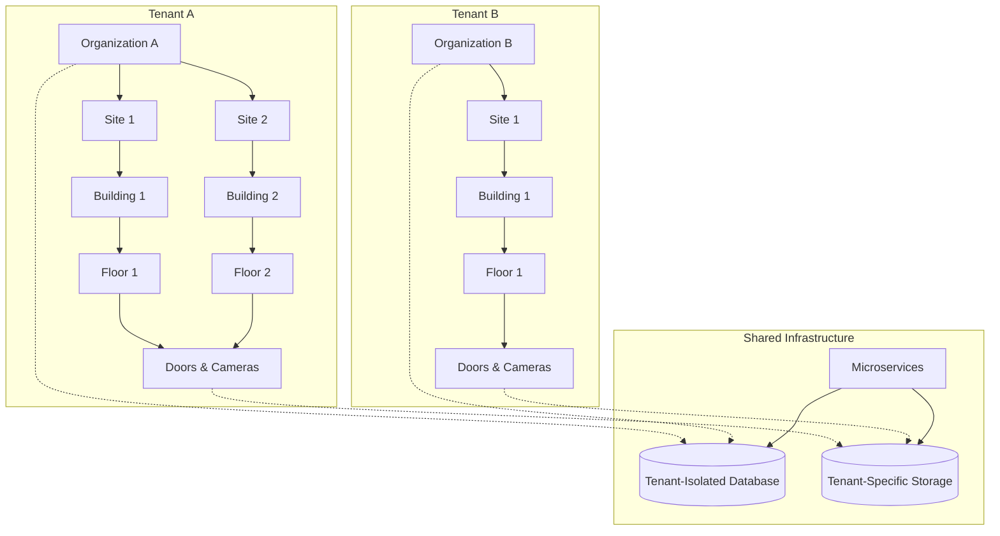
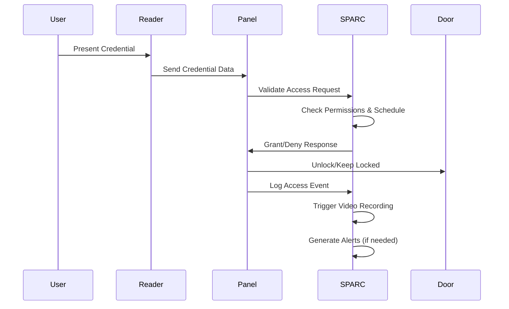
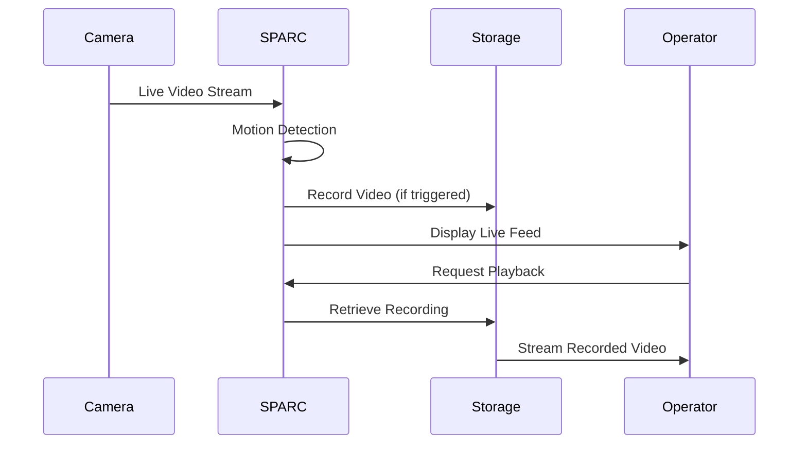
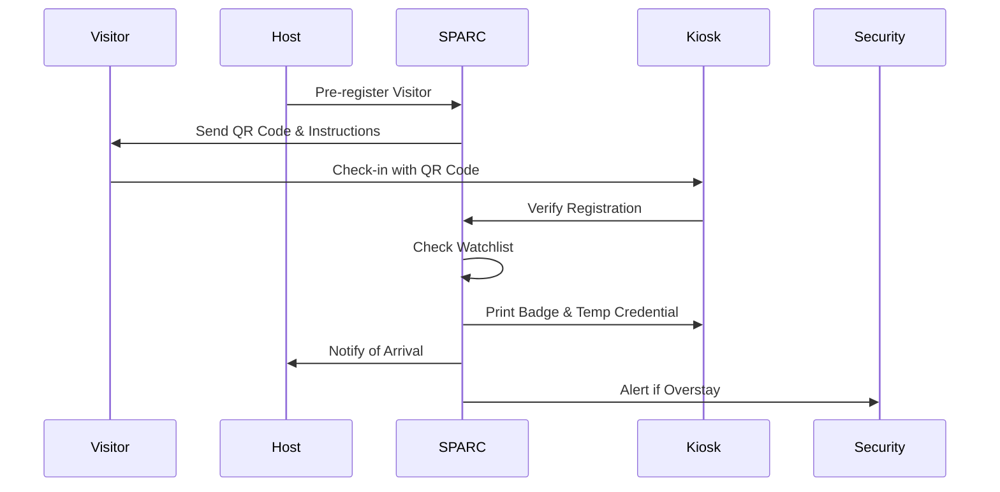

# SPARC - Unified Access Control and Video Surveillance Platform

[](LICENSE)
[](https://github.com/hasanakyol/sparc)
[](https://github.com/hasanakyol/sparc/releases)

SPARC (Unified Access Control and Video Surveillance Platform) is a modern, API-first security management system that combines physical access control with video surveillance in a single, cohesive application. Built with flexible multi-tenant architecture, SPARC serves as a comprehensive security solution that supports both Security Service Providers (SSPs) managing multiple enterprise clients and direct enterprise deployments, scaling from single buildings to enterprise-wide deployments.

## 🎯 What is SPARC?

SPARC addresses the growing need for integrated security solutions by unifying traditional access control with modern surveillance technology. The platform provides:

- **Unified Security Management**: Single platform for access control and video surveillance
- **Flexible Deployment Models**: Support for SSP-managed, self-managed, and hybrid operational models
- **Multi-Tenant Architecture**: Complete data isolation for service providers hosting multiple organizations
- **Enterprise-Scale**: Support for complex multi-site, multi-building deployments
- **Offline Resilience**: 72-hour operation capability without network connectivity
- **Modern Hardware Support**: Integration with leading manufacturers using current protocols

## 🏗️ System Architecture

```mermaid
graph TB
    subgraph "Client Layer"
        WEB[Web Application]
        API_CLIENT[API Clients]
        MOBILE[Mobile Browsers]
    end
    
    subgraph "API Gateway Layer"
        GATEWAY[API Gateway]
        AUTH[Authentication Service]
        RATE_LIMIT[Rate Limiting]
    end
    
    subgraph "Application Services"
        ACCESS_SVC[Access Control Service]
        VIDEO_SVC[Video Management Service]
        EVENT_SVC[Event Processing Service]
        ANALYTICS_SVC[Analytics Service]
        TENANT_SVC[Tenant Management Service]
        DEVICE_SVC[Device Management Service]
        ALERT_SVC[Alert Service]
        REPORT_SVC[Reporting Service]
        INTEGRATION_SVC[Integration Service]
        MOBILE_SVC[Mobile Credential Service]
        ENV_SVC[Environmental Monitoring Service]
        VISITOR_SVC[Visitor Management Service]
        DEPLOYMENT_SVC[Deployment Model Service]
    end
    
    subgraph "Data Layer"
        POSTGRES[(PostgreSQL)]
        REDIS[(Redis Cache)]
        OBJECT_STORE[(Object Storage)]
    end
    
    subgraph "Hardware Layer"
        PANELS[Access Panels]
        READERS[Card Readers]
        CAMERAS[IP Cameras]
        ENV_SENSORS[Environmental Sensors]
        ELEVATORS[Elevator Systems]
    end
    
    WEB --> GATEWAY
    API_CLIENT --> GATEWAY
    MOBILE --> GATEWAY
    
    GATEWAY --> AUTH
    GATEWAY --> ACCESS_SVC
    GATEWAY --> VIDEO_SVC
    GATEWAY --> EVENT_SVC
    GATEWAY --> ANALYTICS_SVC
    GATEWAY --> TENANT_SVC
    GATEWAY --> DEVICE_SVC
    GATEWAY --> ALERT_SVC
    GATEWAY --> REPORT_SVC
    GATEWAY --> DEPLOYMENT_SVC
    
    ACCESS_SVC --> POSTGRES
    ACCESS_SVC --> REDIS
    VIDEO_SVC --> POSTGRES
    VIDEO_SVC --> OBJECT_STORE
    EVENT_SVC --> POSTGRES
    EVENT_SVC --> REDIS
    ANALYTICS_SVC --> POSTGRES
    TENANT_SVC --> POSTGRES
    DEVICE_SVC --> POSTGRES
    DEVICE_SVC --> REDIS
    ALERT_SVC --> REDIS
    REPORT_SVC --> POSTGRES
    
    ACCESS_SVC --> PANELS
    ACCESS_SVC --> READERS
    VIDEO_SVC --> CAMERAS
    DEVICE_SVC --> ENV_SENSORS
    INTEGRATION_SVC --> ELEVATORS
```



## 🚀 Key Features

### 🔐 Access Control
- **Physical Access Management**: Control entry to buildings, floors, and zones
- **Advanced Features**: Anti-passback, dual authorization, emergency lockdown
- **Mobile Credentials**: NFC and Bluetooth BLE support for iOS and Android
- **Visitor Management**: Pre-registration, self-service check-in, temporary access
- **Offline Operation**: 72-hour operation without network connectivity

### 📹 Video Surveillance
- **Live Streaming**: Real-time video with <2-second latency
- **Recording & Playback**: Motion-triggered recording with timeline navigation
- **Multi-Camera Views**: Up to 64 simultaneous camera feeds
- **Video Analytics**: Motion detection, line crossing, camera tampering
- **Privacy Compliance**: Masking, retention policies, audit trails

### 🏢 Multi-Tenant & Enterprise
- **Flexible Deployment Models**: SSP-managed, self-managed, and hybrid operational approaches
- **Complete Tenant Isolation**: Secure data separation for service providers
- **Hierarchical Organization**: Tenant > Organization > Site > Building > Floor > Zone > Door
- **Cross-Site Management**: Enterprise-wide policies with site-specific overrides
- **Resource Management**: Per-tenant quotas and usage tracking
- **Operational Handoffs**: Time-based responsibility management for hybrid deployments

### 🔧 Hardware Integration
- **Modern Protocols**: OSDP v2.2, ONVIF Profile S/T/G, TCP/IP, REST APIs
- **Major Manufacturers**: HID, Honeywell, Bosch, Axis, Hikvision, Dahua, Hanwha, Genetec
- **Auto-Discovery**: Network scanning, DHCP monitoring, mDNS
- **Centralized Management**: Unified configuration and firmware updates

### 📊 Analytics & Intelligence
- **Behavioral Analysis**: Anomaly detection and risk scoring
- **Occupancy Tracking**: Real-time space utilization monitoring
- **Advanced Video Analytics**: Person detection, face recognition, license plate recognition
- **Predictive Insights**: Machine learning for threat prediction

### 🔗 Integration & APIs
- **API-First Design**: RESTful APIs with <200ms response times
- **Building Systems**: HVAC, fire safety, elevator integration
- **Identity Management**: LDAP/Active Directory synchronization
- **Compliance**: SOX, HIPAA, PCI-DSS reporting templates

## 🛠️ Technology Stack

### Backend
- **Framework**: Hono (Node.js) with TypeScript
- **Database**: Amazon RDS PostgreSQL with Multi-AZ deployment
- **Cache**: Amazon ElastiCache Redis with cluster mode
- **Object Storage**: Amazon S3 with S3 Intelligent Tiering
- **CDN**: Amazon CloudFront for global distribution
- **Container Orchestration**: Amazon EKS (Elastic Kubernetes Service)

### Frontend
- **Framework**: Next.js App Router with TypeScript
- **Styling**: Tailwind CSS
- **UI Components**: Shadcn/ui with Radix UI primitives
- **Accessibility**: WCAG 2.1 AA compliance

### Infrastructure
- **Cloud Provider**: Amazon Web Services (AWS)
- **Infrastructure as Code**: AWS CDK
- **CI/CD**: AWS CodePipeline with CodeBuild and CodeDeploy
- **Monitoring**: CloudWatch, X-Ray tracing

## 👥 User Personas & Use Cases

### 🏢 Service Provider (SSP)
**Who**: Security service companies hosting multiple client organizations
**Needs**: 
- Complete tenant isolation and data security
- Usage tracking and billing capabilities
- Scalable infrastructure for multiple clients
- Centralized management with tenant-specific branding
- Client context switching with <2 second performance
- Cross-client operations and health monitoring

**Use Cases**:
- Onboard new client organizations with isolated environments
- Monitor usage across all tenants for accurate billing
- Provide white-label security services with custom branding
- Manage 100+ client organizations with efficient switching
- Generate cross-client analytics and health reports

### 🏭 Enterprise Security Manager
**Who**: Large organizations with multiple sites and complex security requirements
**Needs**:
- Centralized management across multiple locations
- Consistent security policies with site-specific flexibility
- Comprehensive reporting and compliance capabilities
- Integration with existing enterprise systems
- Self-managed deployment without SSP overhead
- Focused interface for single organization operations

**Use Cases**:
- Manage security across 50+ office locations globally
- Implement company-wide access policies with local exceptions
- Generate compliance reports for regulatory audits
- Integrate with HR systems for automated employee access management
- Deploy self-managed solution with full control
- Transition between deployment models as needed

### 🏢 Facilities Security Administrator
**Who**: Day-to-day security operations managers for individual buildings or campuses
**Needs**:
- Real-time monitoring and alert management
- Easy-to-use interface for daily operations
- Quick incident response capabilities
- Visitor management and temporary access control
- Clear operational responsibility indicators in hybrid mode
- Deployment model awareness for appropriate interface

**Use Cases**:
- Monitor live camera feeds and respond to security alerts
- Manage visitor check-ins and temporary access credentials
- Generate incident reports with correlated video evidence
- Configure access schedules and holiday exceptions
- Operate in hybrid deployments with clear handoff boundaries
- Switch between deployment models as operational needs change

### 👮 Security Operator
**Who**: Front-line security personnel monitoring systems 24/7
**Needs**:
- Intuitive dashboards with real-time status
- Clear alert prioritization and escalation
- Quick access to video evidence
- Mobile-friendly interface for patrol duties

**Use Cases**:
- Monitor multiple camera feeds simultaneously
- Respond to access control violations with video verification
- Acknowledge and escalate security alerts
- Export video evidence for incident investigation

### 🔧 System Administrator
**Who**: IT professionals responsible for system maintenance and configuration
**Needs**:
- Comprehensive device management tools
- Automated maintenance scheduling
- Performance monitoring and optimization
- Integration with existing IT infrastructure
- Deployment model configuration and transitions
- Permission management across different operational models

**Use Cases**:
- Configure and maintain access control panels and cameras
- Monitor system performance and resource utilization
- Schedule firmware updates and preventive maintenance
- Integrate with LDAP/Active Directory for user management
- Configure SSP-managed, self-managed, or hybrid deployments
- Manage transitions between deployment models without disruption

## 🏗️ Multi-Tenant Architecture

SPARC's flexible multi-tenant architecture provides complete isolation between organizations while enabling efficient resource sharing and supporting multiple deployment models:



### Tenant Isolation Features
- **Database Level**: Tenant-specific schemas with row-level security
- **Application Level**: Tenant context in all service calls
- **API Level**: Tenant-scoped authentication tokens
- **Storage Level**: Tenant-specific object storage buckets
- **Resource Level**: Per-tenant quotas and usage tracking
- **Branding Level**: Tenant-specific UI customization

### Deployment Model Support
- **SSP-Managed**: Multi-client organization management with complete isolation
- **Self-Managed**: Direct enterprise control without SSP layer overhead
- **Hybrid**: Shared access with time-based responsibility handoffs
- **Model Transitions**: Seamless switching between deployment approaches
- **Context Switching**: <2 second performance for SSP client switching

## 🔄 User Flows

### Access Control Flow


### Video Surveillance Flow


### Visitor Management Flow


## 🔧 Hardware Support

### Access Control Hardware
- **Panels**: HID, Honeywell, Bosch with OSDP v2.2 and TCP/IP
- **Readers**: Smart card (Mifare, DESFire, iCLASS Seos) and mobile credentials
- **Locks**: Electric strikes, magnetic locks, motorized locks, turnstiles
- **Auxiliary**: IP-based intercoms, visitor kiosks, perimeter sensors

### Video Surveillance Hardware
- **Cameras**: Axis, Hikvision, Dahua, Bosch, Hanwha, Genetec
- **Protocols**: ONVIF Profile S/T/G, RTSP over TCP/IP, HTTP/HTTPS APIs
- **Features**: PTZ control, multi-resolution streaming, edge recording

### Environmental Monitoring
- **Sensors**: Temperature, humidity, leak detection
- **Integration**: HVAC systems, building automation
- **Protocols**: SNMP, BACnet, proprietary APIs

### Elevator Integration
- **Manufacturers**: Otis, KONE, Schindler, ThyssenKrupp
- **Features**: Floor access control, destination dispatch, emergency override

## 📈 Performance Specifications

- **Access Points**: Support for up to 10,000 doors per installation
- **Video Streams**: Up to 1,000 concurrent camera streams
- **API Response**: <200ms for standard operations (95th percentile)
- **Video Latency**: <2 seconds for live streaming
- **Database Performance**: <500ms query response times
- **UI Performance**: 64-camera grid with real-time updates
- **Offline Operation**: 72-hour continuous operation
- **Failover**: 30-second automatic system failover
- **Mesh Networking**: 15-minute credential revocation propagation
- **Context Switching**: <2 seconds for SSP client switching
- **Deployment Models**: Support for 100+ SSP clients and 50+ enterprise sites

## 🔒 Security & Compliance

### Data Protection
- **Encryption at Rest**: AES-256 using AWS KMS
- **Encryption in Transit**: TLS 1.3 for all communications
- **Certificate Management**: Automated lifecycle with AWS Certificate Manager
- **Audit Logging**: Immutable 7-year retention for all activities

### Network Security
- **Device Authentication**: Certificate-based device identity
- **Intrusion Detection**: AWS GuardDuty for real-time monitoring
- **Threat Prevention**: AWS WAF and Shield for automated response
- **Network Segmentation**: VLAN isolation for device networks

### Compliance Frameworks
- **SOX**: Sarbanes-Oxley compliance reporting
- **HIPAA**: Healthcare data protection requirements
- **PCI-DSS**: Payment card industry standards
- **GDPR/CCPA**: Privacy rights and data subject requests

## 🚀 Getting Started

### Prerequisites
- AWS Account with appropriate permissions
- Docker and Docker Compose for local development
- Node.js 18+ and npm/yarn
- PostgreSQL 14+ for local development

### Quick Start
```bash
# Clone the repository
git clone https://github.com/hasanakyol/sparc.git
cd sparc

# Install dependencies
npm install

# Set up environment variables
cp .env.example .env
# Edit .env with your configuration

# Start local development environment
docker-compose up -d

# Run database migrations
npm run migrate

# Start the development server
npm run dev
```

### Deployment
```bash
# Deploy to AWS using CDK
npm run deploy:staging
npm run deploy:production
```

## 📚 Documentation

- [API Documentation](docs/api/README.md) - Complete REST API reference
- [Installation Guide](docs/installation/README.md) - Deployment and configuration
- [User Manual](docs/user-guide/README.md) - End-user documentation
- [Administrator Guide](docs/admin-guide/README.md) - System administration
- [Integration Guide](docs/integration/README.md) - Third-party integrations
- [Hardware Compatibility](docs/hardware/README.md) - Supported devices

## 🤝 Contributing

We welcome contributions to SPARC! Please read our [Contributing Guide](CONTRIBUTING.md) for details on our code of conduct and the process for submitting pull requests.

### Development Setup
```bash
# Install development dependencies
npm install --include=dev

# Run tests
npm test

# Run linting
npm run lint

# Run type checking
npm run type-check
```

## 📄 License

This project is licensed under the MIT License - see the [LICENSE](LICENSE) file for details.

## 🆘 Support

- **Documentation**: [docs.sparc-platform.com](https://docs.sparc-platform.com)
- **Community Forum**: [community.sparc-platform.com](https://community.sparc-platform.com)
- **Issue Tracker**: [GitHub Issues](https://github.com/hasanakyol/sparc/issues)
- **Enterprise Support**: [support@sparc-platform.com](mailto:support@sparc-platform.com)

## 🗺️ Roadmap

### Initial Release (v1.0)
- ✅ Complete access control and video surveillance platform
- ✅ Flexible multi-tenant architecture with deployment model support
- ✅ Mobile credential support (NFC/BLE)
- ✅ Advanced analytics and reporting
- ✅ Comprehensive hardware integration
- ✅ SSP-managed, self-managed, and hybrid deployment models

### Future Releases
- 🔄 AI-powered behavioral analytics
- 🔄 Advanced facial recognition capabilities
- 🔄 IoT sensor integration expansion
- 🔄 Mobile application for operators
- 🔄 Cloud-to-cloud integrations

## 📊 System Requirements

### Minimum Requirements
- **CPU**: 4 cores, 2.4 GHz
- **RAM**: 16 GB
- **Storage**: 500 GB SSD
- **Network**: 1 Gbps Ethernet
- **OS**: Linux (Ubuntu 20.04+ recommended)

### Recommended for Production
- **CPU**: 8+ cores, 3.0+ GHz
- **RAM**: 32+ GB
- **Storage**: 1+ TB NVMe SSD
- **Network**: 10 Gbps Ethernet
- **OS**: Linux with container orchestration (Kubernetes)

### Cloud Deployment (AWS)
- **Compute**: EKS cluster with auto-scaling node groups
- **Database**: RDS PostgreSQL with Multi-AZ deployment
- **Storage**: S3 with CloudFront CDN
- **Networking**: VPC with private subnets and NAT gateways

---

**SPARC** - Securing the future of access control and video surveillance through unified, intelligent, and scalable solutions.