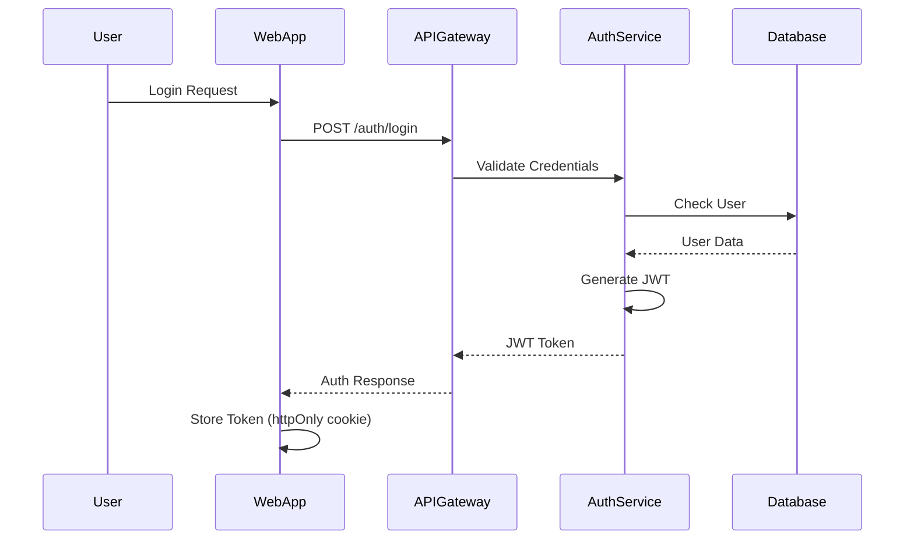

# SPARC Security Architecture

## Executive Summary

SPARC implements a defense-in-depth security architecture designed to protect critical surveillance infrastructure, video data, and operational systems. The platform employs multiple layers of security controls including network segmentation, strong authentication, end-to-end encryption, and comprehensive monitoring. It serves as a production-ready security platform supporting 10,000+ concurrent users and 100,000+ video streams.

## Table of Contents

1. [Security Architecture Overview](#security-architecture-overview)
2. [System Security Boundaries](#system-security-boundaries)
3. [Authentication & Authorization](#authentication--authorization)
4. [Encryption Implementation](#encryption-implementation)
5. [Network Security Architecture](#network-security-architecture)
6. [Data Protection Mechanisms](#data-protection-mechanisms)
7. [Application Security](#application-security)
8. [Infrastructure Security](#infrastructure-security)
9. [Security Monitoring & Incident Response](#security-monitoring--incident-response)
10. [Compliance & Audit](#compliance--audit)
11. [Disaster Recovery & Business Continuity](#disaster-recovery--business-continuity)
12. [Security Metrics & KPIs](#security-metrics--kpis)

## Security Architecture Overview

### Defense in Depth Layers

```
┌─────────────────────────────────────────────────────────────┐
│                    Internet / External Network               │
└─────────────────────┬───────────────────────────────────────┘
                      │
                ┌─────┴─────┐
                │    WAF    │ ← DDoS Protection, Rate Limiting
                └─────┬─────┘
                      │
                ┌─────┴─────┐
                │    CDN    │ ← Static Asset Caching, TLS Termination
                └─────┬─────┘
                      │
            ┌─────────┴─────────┐
            │   Load Balancer   │ ← Health Checks, SSL/TLS
            └─────────┬─────────┘
                      │
            ┌─────────┴─────────┐
            │   API Gateway     │ ← Auth/Rate Limiting
            └─────────┬─────────┘
                      │
            ┌─────────┴─────────┐
            │  Service Mesh     │ ← mTLS/Policies
            └─────────┬─────────┘
                      │
            ┌─────────┴─────────┐
            │  Microservices    │ ← App Security
            └─────────┬─────────┘
                      │
            ┌─────────┴─────────┐
            │    Database       │ ← Encryption/RLS
            └───────────────────┘
```

### Security Principles

1. **Least Privilege**: Users and services have minimum required permissions
2. **Zero Trust**: Verify everything, trust nothing
3. **Defense in Depth**: Multiple security layers
4. **Fail Secure**: Deny by default on errors
5. **Separation of Concerns**: Isolated components and responsibilities

## System Security Boundaries

### 1. External Perimeter

- **WAF (Web Application Firewall)**: DDoS protection, SQL injection prevention, rate limiting
- **CDN (Content Delivery Network)**: Static asset caching, TLS termination, geographic distribution
- **Load Balancer**: Health checks, SSL/TLS termination, traffic distribution

### 2. Application Layer Security Zones

#### DMZ (Demilitarized Zone)
- **Components**: API Gateway, Web Application Frontend
- **Security Controls**: 
  - Reverse proxy configuration
  - Request validation and sanitization
  - Rate limiting per tenant
  - Geographic IP filtering

#### Application Zone
- **Components**: Microservices (Auth, Video Processing, Analytics, etc.)
- **Security Controls**:
  - Service mesh with mTLS
  - Zero-trust service communication
  - Pod security policies
  - Network policies for service isolation

#### Data Zone
- **Components**: PostgreSQL, Redis, S3/Blob Storage
- **Security Controls**:
  - Encrypted connections (TLS 1.3)
  - Database firewall rules
  - Storage encryption at rest
  - Access control lists (ACLs)

### 3. Trust Boundaries

```typescript
// Trust boundary enforcement example
export const trustBoundaryMiddleware = async (c: Context, next: Next) => {
  const source = c.req.header('X-Service-Name');
  const target = c.env.SERVICE_NAME;
  
  // Validate service-to-service communication
  if (!isAllowedServiceCommunication(source, target)) {
    throw new HTTPException(403, { message: 'Service communication not allowed' });
  }
  
  await next();
};
```

### 4. Network Segmentation

```yaml
Production VPC:
  Public Subnet:
    - Load Balancers
    - NAT Gateways
  Private Subnet:
    - Application Servers
    - Internal Services
  Database Subnet:
    - RDS Instances
    - ElastiCache
  Management Subnet:
    - Bastion Hosts
    - VPN Endpoints
```

## Authentication & Authorization

### Authentication Methods

#### 1. Username/Password
- Minimum 12 characters
- Complexity requirements enforced
- Password history (last 5)
- Breach detection via HaveIBeenPwned

#### 2. Multi-Factor Authentication (MFA)

```typescript
// MFA implementation
export class MFAService {
  async generateTOTP(userId: string): Promise<{ secret: string; qrCode: string }> {
    const secret = authenticator.generateSecret();
    const otpauth = authenticator.keyuri(
      userId,
      'SPARC Security Platform',
      secret
    );
    
    // Encrypt secret before storage
    const encryptedSecret = await encrypt(secret, process.env.ENCRYPTION_KEY);
    await db.update(users)
      .set({ mfaSecret: encryptedSecret })
      .where(eq(users.id, userId));
    
    const qrCode = await QRCode.toDataURL(otpauth);
    return { secret, qrCode };
  }
  
  async verifyTOTP(userId: string, token: string): Promise<boolean> {
    const user = await db.query.users.findFirst({
      where: eq(users.id, userId)
    });
    
    const secret = await decrypt(user.mfaSecret, process.env.ENCRYPTION_KEY);
    return authenticator.verify({ token, secret });
  }
}
```

- TOTP-based (RFC 6238)
- Backup codes
- Recovery tokens
- Required for admin accounts

#### 3. Single Sign-On (SSO)
- SAML 2.0 support
- OAuth 2.0 / OpenID Connect
- Active Directory integration

#### 4. API Authentication
- JWT tokens (short-lived)
- API keys for service accounts
- Certificate-based for IoT devices

### Authorization Model

#### Role-Based Access Control (RBAC)

```typescript
// RBAC permission structure
export const permissions = {
  'system.admin': ['*'],
  'org.admin': [
    'org:read', 'org:write',
    'site:*',
    'user:*',
    'camera:*',
    'incident:*'
  ],
  'site.manager': [
    'site:read', 'site:write',
    'zone:*',
    'camera:*',
    'incident:*',
    'report:read'
  ],
  'security.operator': [
    'site:read',
    'camera:read', 'camera:control',
    'incident:read', 'incident:write',
    'alert:read'
  ],
  'viewer': [
    'site:read',
    'camera:read',
    'incident:read'
  ]
};

// Authorization middleware
export const authorize = (requiredPermission: string) => {
  return async (c: Context, next: Next) => {
    const user = c.get('user');
    const userPermissions = getUserPermissions(user.role);
    
    if (!hasPermission(userPermissions, requiredPermission)) {
      throw new HTTPException(403, { message: 'Insufficient permissions' });
    }
    
    await next();
  };
};
```

#### Attribute-Based Access Control (ABAC)

```typescript
interface Policy {
  resource: string;
  action: string;
  conditions: Condition[];
}

// Multi-tenant isolation
interface TenantContext {
  organizationId: string;
  siteId?: string;
  zoneId?: string;
}
```

### JWT Token Structure

```json
{
  "header": {
    "alg": "RS256",
    "typ": "JWT",
    "kid": "2024-01-key-id"
  },
  "payload": {
    "sub": "user-uuid",
    "iss": "https://api.sparc.security",
    "aud": ["sparc-web", "sparc-api"],
    "exp": 1234567890,
    "iat": 1234567890,
    "jti": "unique-token-id",
    "user": {
      "id": "user-uuid",
      "email": "user@example.com",
      "organizationId": "org-uuid",
      "role": "site.manager",
      "permissions": ["site:read", "camera:*"]
    },
    "tenant": {
      "organizationId": "org-uuid",
      "siteIds": ["site-uuid-1", "site-uuid-2"]
    }
  }
}
```

### Session Management

- HttpOnly, Secure, SameSite cookies
- 15-minute access token expiry
- 7-day refresh token expiry
- Session invalidation on logout
- Concurrent session limits

### Authentication Flow



## Encryption Implementation

### 1. Data Encryption at Rest

#### Database Encryption

```typescript
// Database encryption configuration
export const databaseConfig = {
  connection: {
    ssl: {
      require: true,
      rejectUnauthorized: true,
      ca: fs.readFileSync('./certs/ca-cert.pem')
    }
  },
  // Transparent Data Encryption (TDE) enabled at database level
  encryption: {
    enabled: true,
    keyRotationDays: 90
  }
};

// Application-level encryption for sensitive fields
export class EncryptionService {
  private algorithm = 'aes-256-gcm';
  private keyDerivationIterations = 100000;
  
  async encryptField(data: string, context: string): Promise<EncryptedData> {
    const key = await this.deriveKey(process.env.MASTER_KEY, context);
    const iv = crypto.randomBytes(16);
    const cipher = crypto.createCipheriv(this.algorithm, key, iv);
    
    let encrypted = cipher.update(data, 'utf8', 'hex');
    encrypted += cipher.final('hex');
    
    const authTag = cipher.getAuthTag();
    
    return {
      encrypted,
      iv: iv.toString('hex'),
      authTag: authTag.toString('hex'),
      algorithm: this.algorithm,
      keyVersion: process.env.KEY_VERSION
    };
  }
}
```

- AES-256-GCM for sensitive fields
- Transparent Data Encryption (TDE)
- Encrypted backups

#### File Storage
- S3 server-side encryption (SSE-S3)
- Customer-managed keys (CMK) for sensitive data
- Encrypted EBS volumes

#### Key Management
- AWS KMS / Azure Key Vault / GCP KMS
- Regular key rotation (90 days)
- Hardware Security Module (HSM) for critical keys

### 2. Data Encryption in Transit

#### External Communication
- TLS 1.3 minimum
- Strong cipher suites only
- Certificate pinning for mobile apps
- HSTS enforcement

#### Internal Communication

```yaml
# Kubernetes service mesh configuration for mTLS
apiVersion: security.istio.io/v1beta1
kind: PeerAuthentication
metadata:
  name: default
  namespace: sparc-services
spec:
  mtls:
    mode: STRICT
---
apiVersion: security.istio.io/v1beta1
kind: AuthorizationPolicy
metadata:
  name: service-communication
spec:
  action: ALLOW
  rules:
  - from:
    - source:
        principals: ["cluster.local/ns/sparc-services/sa/*"]
    to:
    - operation:
        methods: ["GET", "POST", "PUT", "DELETE"]
```

- Mutual TLS (mTLS) between services
- Service mesh encryption
- IPSec for cross-region traffic

### 3. Video Stream Encryption

```typescript
// HLS encryption for video streams
export class VideoEncryptionService {
  async generateEncryptionKey(streamId: string): Promise<EncryptionKey> {
    const key = crypto.randomBytes(16);
    const iv = crypto.randomBytes(16);
    
    // Store key in secure key management service
    await keyManagementService.storeKey({
      keyId: `stream-${streamId}`,
      key: key.toString('hex'),
      iv: iv.toString('hex'),
      algorithm: 'aes-128-cbc',
      expiry: Date.now() + (24 * 60 * 60 * 1000) // 24 hours
    });
    
    return { key, iv, keyId: `stream-${streamId}` };
  }
  
  generateKeyInfoFile(keyUrl: string): string {
    return `#EXT-X-KEY:METHOD=AES-128,URI="${keyUrl}",IV=0x${iv.toString('hex')}`;
  }
}
```

### 4. Backup Encryption

```typescript
// Encrypted backup implementation
export class BackupEncryptionService {
  async createEncryptedBackup(data: Buffer): Promise<EncryptedBackup> {
    // Generate backup-specific key
    const backupKey = crypto.randomBytes(32);
    const iv = crypto.randomBytes(16);
    
    // Encrypt backup data
    const cipher = crypto.createCipheriv('aes-256-gcm', backupKey, iv);
    const encrypted = Buffer.concat([
      cipher.update(data),
      cipher.final()
    ]);
    const authTag = cipher.getAuthTag();
    
    // Encrypt backup key with master key
    const encryptedKey = await this.encryptWithMasterKey(backupKey);
    
    // Store encrypted backup
    const backupId = uuidv4();
    await storageService.uploadBackup({
      id: backupId,
      data: encrypted,
      metadata: {
        iv: iv.toString('base64'),
        authTag: authTag.toString('base64'),
        encryptedKey: encryptedKey.toString('base64'),
        timestamp: new Date().toISOString(),
        checksum: crypto.createHash('sha256').update(data).digest('hex')
      }
    });
    
    return { backupId, size: encrypted.length };
  }
}
```

## Network Security Architecture

### 1. Firewall Rules

#### Ingress Rules
- Allow 443 from Internet to ALB
- Allow 22 from Bastion only
- Deny all other inbound

#### Egress Rules
- Allow specific ports to required services
- Block all unnecessary outbound
- Log all denied attempts

### 2. Network Policies

```yaml
# Kubernetes NetworkPolicy for service isolation
apiVersion: networking.k8s.io/v1
kind: NetworkPolicy
metadata:
  name: video-service-isolation
  namespace: sparc-services
spec:
  podSelector:
    matchLabels:
      app: video-processor
  policyTypes:
  - Ingress
  - Egress
  ingress:
  - from:
    - namespaceSelector:
        matchLabels:
          name: sparc-services
      podSelector:
        matchLabels:
          app: api-gateway
    ports:
    - protocol: TCP
      port: 50051  # gRPC
  egress:
  - to:
    - namespaceSelector:
        matchLabels:
          name: sparc-services
    ports:
    - protocol: TCP
      port: 5432  # PostgreSQL
  - to:
    - namespaceSelector:
        matchLabels:
          name: sparc-services
      podSelector:
        matchLabels:
          app: storage-service
```

### 3. API Gateway Security

```typescript
// API Gateway security configuration
export const securityMiddleware = compose(
  // Rate limiting per tenant
  rateLimiter({
    windowMs: 60 * 1000, // 1 minute
    max: (req) => {
      const tenant = req.user?.tenant;
      return tenant?.plan === 'enterprise' ? 1000 : 100;
    }
  }),
  
  // Request size limiting
  bodyParser({
    limit: '10mb',
    type: ['application/json', 'application/x-www-form-urlencoded']
  }),
  
  // CORS configuration
  cors({
    origin: (origin, callback) => {
      const allowedOrigins = process.env.ALLOWED_ORIGINS?.split(',') || [];
      if (!origin || allowedOrigins.includes(origin)) {
        callback(null, true);
      } else {
        callback(new Error('Not allowed by CORS'));
      }
    },
    credentials: true
  }),
  
  // Security headers
  helmet({
    contentSecurityPolicy: {
      directives: {
        defaultSrc: ["'self'"],
        scriptSrc: ["'self'", "'unsafe-inline'"],
        styleSrc: ["'self'", "'unsafe-inline'"],
        imgSrc: ["'self'", "data:", "https:"],
        connectSrc: ["'self'", "wss:", "https:"],
        frameAncestors: ["'none'"],
        objectSrc: ["'none'"],
        upgradeInsecureRequests: []
      }
    },
    hsts: {
      maxAge: 31536000,
      includeSubDomains: true,
      preload: true
    }
  })
);
```

### 4. Web Application Firewall (WAF) Rules

```json
{
  "rules": [
    {
      "id": "block-sql-injection",
      "priority": 1,
      "statement": {
        "regexMatchStatement": {
          "regexString": "(?i)(union.*select|select.*from|insert.*into|delete.*from|drop.*table|script.*>|<.*script)",
          "fieldToMatch": {
            "allQueryArguments": {}
          }
        }
      },
      "action": {
        "block": {}
      }
    },
    {
      "id": "rate-limit-api",
      "priority": 2,
      "statement": {
        "rateBasedStatement": {
          "limit": 2000,
          "aggregateKeyType": "IP"
        }
      },
      "action": {
        "block": {}
      }
    },
    {
      "id": "geo-blocking",
      "priority": 3,
      "statement": {
        "notStatement": {
          "statement": {
            "geoMatchStatement": {
              "countryCodes": ["US", "CA", "GB", "AU", "NZ"]
            }
          }
        }
      },
      "action": {
        "block": {}
      }
    }
  ]
}
```

### 5. DDoS Protection

- CloudFlare / AWS Shield
- Rate limiting at multiple layers
- Geographic restrictions
- Automated blocking of suspicious IPs

## Data Protection Mechanisms

### 1. Data Classification

| Level | Description | Examples | Protection |
|-------|-------------|----------|------------|
| Public | No harm if disclosed | Marketing content | Standard |
| Internal | Internal use only | Employee directories | Encrypted at rest |
| Confidential | Business sensitive | Financial data | Encrypted + access control |
| Restricted | Highly sensitive | Credentials, PII | Encrypted + audit + MFA |

### 2. Personal Data Protection

```typescript
// PII encryption and tokenization
export class PIIProtectionService {
  async protectPII(data: any): Promise<any> {
    const piiFields = ['ssn', 'creditCard', 'driverLicense', 'passport'];
    const protectedData = { ...data };
    
    for (const field of piiFields) {
      if (protectedData[field]) {
        // Tokenize sensitive data
        const token = await this.tokenize(protectedData[field]);
        protectedData[field] = token;
        
        // Store encrypted original in secure vault
        await secureVault.store({
          token,
          value: await this.encrypt(protectedData[field]),
          type: field,
          expiry: this.getRetentionPeriod(field)
        });
      }
    }
    
    return protectedData;
  }
  
  async tokenize(value: string): Promise<string> {
    const hash = crypto.createHash('sha256')
      .update(value + process.env.TOKENIZATION_SALT)
      .digest('hex');
    return `tok_${hash.substring(0, 24)}`;
  }
}
```

### 3. Data Loss Prevention (DLP)

```typescript
// DLP scanning for sensitive data exposure
export class DLPService {
  private patterns = {
    creditCard: /\b(?:\d{4}[\s-]?){3}\d{4}\b/,
    ssn: /\b\d{3}-\d{2}-\d{4}\b/,
    email: /\b[A-Za-z0-9._%+-]+@[A-Za-z0-9.-]+\.[A-Z|a-z]{2,}\b/,
    apiKey: /\b[A-Za-z0-9]{32,}\b/
  };
  
  async scanResponse(data: any): Promise<DLPScanResult> {
    const violations = [];
    const stringData = JSON.stringify(data);
    
    for (const [type, pattern] of Object.entries(this.patterns)) {
      if (pattern.test(stringData)) {
        violations.push({
          type,
          severity: this.getSeverity(type),
          action: 'block'
        });
      }
    }
    
    if (violations.length > 0) {
      await this.logViolation(violations);
      throw new DLPViolationError('Sensitive data detected in response');
    }
    
    return { clean: true, violations: [] };
  }
}
```

## Application Security

### 1. Secure Coding Practices

#### Input Validation

```typescript
// All inputs validated with Zod schemas
const schema = z.object({
  email: z.string().email(),
  age: z.number().min(0).max(150)
});
```

#### Output Encoding

```typescript
// Automatic XSS protection
const safe = escapeHtml(userInput);
```

#### SQL Injection Prevention

```typescript
// Parameterized queries only
prisma.user.findMany({
  where: { email: userEmail }
});
```

### 2. Security Headers

```typescript
app.use(secureHeaders({
  contentSecurityPolicy: {
    defaultSrc: ["'self'"],
    scriptSrc: ["'self'", "'unsafe-inline'"]
  },
  hsts: {
    maxAge: 31536000,
    includeSubDomains: true,
    preload: true
  }
}));
```

### 3. OWASP Top 10 Mitigation

1. **Injection**: Parameterized queries, input validation
2. **Broken Authentication**: MFA, secure session management
3. **Sensitive Data Exposure**: Encryption everywhere
4. **XML External Entities**: XML parsing disabled
5. **Broken Access Control**: RBAC + ABAC
6. **Security Misconfiguration**: Hardened configurations
7. **XSS**: CSP, output encoding
8. **Insecure Deserialization**: JSON schema validation
9. **Vulnerable Components**: Regular scanning
10. **Insufficient Logging**: Comprehensive audit logs

## Infrastructure Security

### 1. Container Security

#### Image Scanning
- Trivy/Grype vulnerability scanning
- No root users
- Minimal base images (distroless)
- Signed images

#### Runtime Security
- Read-only root filesystem
- No privileged containers
- Resource limits enforced
- Network policies

### 2. Kubernetes Security

```yaml
# Pod Security Policy
apiVersion: policy/v1beta1
kind: PodSecurityPolicy
metadata:
  name: restricted
spec:
  privileged: false
  allowPrivilegeEscalation: false
  requiredDropCapabilities:
    - ALL
  volumes:
    - 'configMap'
    - 'emptyDir'
    - 'projected'
    - 'secret'
    - 'downwardAPI'
    - 'persistentVolumeClaim'
  runAsUser:
    rule: 'MustRunAsNonRoot'
  seLinux:
    rule: 'RunAsAny'
  fsGroup:
    rule: 'RunAsAny'
```

### 3. Cloud Security

#### IAM Best Practices
- Principle of least privilege
- No root account usage
- MFA for all users
- Regular access reviews

#### Resource Tagging
- Environment classification
- Data sensitivity labels
- Compliance requirements
- Cost allocation

### 4. Secrets Management

```typescript
// Centralized secrets management
export class SecretsManager {
  private vaultClient: VaultClient;
  
  async getSecret(path: string): Promise<string> {
    try {
      // Attempt to get from cache first
      const cached = await this.cache.get(path);
      if (cached) return cached;
      
      // Fetch from vault
      const secret = await this.vaultClient.read(path);
      
      // Cache with TTL
      await this.cache.set(path, secret.data.value, {
        ttl: 300 // 5 minutes
      });
      
      return secret.data.value;
    } catch (error) {
      logger.error('Failed to retrieve secret', { path, error });
      throw new SecurityError('Secret retrieval failed');
    }
  }
  
  async rotateSecret(path: string): Promise<void> {
    const newSecret = crypto.randomBytes(32).toString('hex');
    
    // Update in vault
    await this.vaultClient.write(path, { value: newSecret });
    
    // Clear cache
    await this.cache.delete(path);
    
    // Notify dependent services
    await this.notifySecretRotation(path);
  }
}
```

## Security Monitoring & Incident Response

### 1. Security Event Monitoring

```typescript
// Security event collector
export class SecurityEventCollector {
  async logSecurityEvent(event: SecurityEvent): Promise<void> {
    const enrichedEvent = {
      ...event,
      timestamp: new Date().toISOString(),
      correlationId: uuidv4(),
      environment: process.env.NODE_ENV,
      service: process.env.SERVICE_NAME,
      severity: this.calculateSeverity(event),
      fingerprint: this.generateFingerprint(event)
    };
    
    // Send to SIEM
    await siemClient.send(enrichedEvent);
    
    // Store for analysis
    await db.insert(securityEvents).values(enrichedEvent);
    
    // Real-time alerting for critical events
    if (enrichedEvent.severity === 'critical') {
      await alertingService.sendAlert({
        type: 'security',
        severity: 'critical',
        event: enrichedEvent
      });
    }
  }
}
```

### 2. Intrusion Detection System (IDS)

```typescript
// Application-level IDS
export class IntrusionDetectionService {
  private suspiciousPatterns = [
    { pattern: /(\.\.\/)|(\.\.\\)/, type: 'path_traversal' },
    { pattern: /[<>\"'%;()&+]/, type: 'special_chars' },
    { pattern: /\b(admin|root|sa)\b/i, type: 'privileged_user' }
  ];
  
  async analyzeRequest(req: Request): Promise<ThreatAnalysis> {
    const threats = [];
    
    // Analyze request patterns
    const url = req.url;
    const headers = req.headers;
    const body = await req.text();
    
    // Check for suspicious patterns
    for (const { pattern, type } of this.suspiciousPatterns) {
      if (pattern.test(url) || pattern.test(body)) {
        threats.push({ type, confidence: 'high' });
      }
    }
    
    // Behavioral analysis
    const clientIp = this.getClientIp(req);
    const behaviorScore = await this.analyzeBehavior(clientIp);
    
    if (behaviorScore > 0.8) {
      threats.push({ 
        type: 'suspicious_behavior', 
        confidence: 'medium',
        score: behaviorScore 
      });
    }
    
    return { threats, riskScore: this.calculateRiskScore(threats) };
  }
}
```

### 3. Incident Classification

| Severity | Description | Response Time | Examples |
|----------|-------------|---------------|----------|
| Critical | Business critical impact | 15 minutes | Data breach, ransomware |
| High | Significant impact | 1 hour | Service compromise |
| Medium | Moderate impact | 4 hours | Suspicious activity |
| Low | Minor impact | 24 hours | Policy violations |

### 4. Incident Response Procedures

```typescript
// Automated incident response
export class IncidentResponseOrchestrator {
  async initiateIncidentResponse(detection: ThreatDetection): Promise<void> {
    const incident = await this.createIncident(detection);
    
    // Phase 1: Containment
    await this.containThreat(incident);
    
    // Phase 2: Investigation
    const forensics = await this.collectForensics(incident);
    
    // Phase 3: Eradication
    await this.eradicateThreat(incident, forensics);
    
    // Phase 4: Recovery
    await this.recoverServices(incident);
    
    // Phase 5: Lessons Learned
    await this.documentIncident(incident, forensics);
  }
}
```

### 5. Automated Response Actions

```typescript
// Automated security response
export class SecurityResponseAutomation {
  async handleSecurityIncident(incident: SecurityIncident): Promise<void> {
    const actions = this.determineResponseActions(incident);
    
    for (const action of actions) {
      switch (action.type) {
        case 'block_ip':
          await this.blockIpAddress(action.target, action.duration);
          break;
          
        case 'disable_account':
          await this.disableUserAccount(action.target);
          break;
          
        case 'isolate_service':
          await this.isolateService(action.target);
          break;
          
        case 'force_mfa':
          await this.forceMFAForOrganization(action.target);
          break;
          
        case 'snapshot_forensics':
          await this.captureForensicData(incident);
          break;
      }
      
      await this.logResponseAction(incident.id, action);
    }
    
    // Notify security team
    await this.notifySecurityTeam(incident, actions);
  }
}
```

### 6. Vulnerability Management

Automated scanning and remediation:

- Daily dependency scans
- Container image scans
- Infrastructure scans
- Dynamic application testing

## Compliance & Audit

### 1. Regulatory Compliance

#### GDPR
- Privacy by design
- Data minimization
- Right to erasure
- Data portability

#### HIPAA
- PHI encryption
- Access controls
- Audit trails
- Business Associate Agreements

#### PCI DSS
- Network segmentation
- No card data storage
- Tokenization
- Quarterly scans

#### SOC 2
- Security controls
- Availability monitoring
- Process integrity
- Confidentiality measures

### 2. Audit Logging

```typescript
// Comprehensive audit logging
export class AuditLogger {
  async logAuditEvent(event: AuditEvent): Promise<void> {
    const auditRecord = {
      id: uuidv4(),
      timestamp: new Date().toISOString(),
      actor: {
        id: event.userId,
        ip: event.clientIp,
        userAgent: event.userAgent,
        sessionId: event.sessionId
      },
      action: {
        type: event.action,
        resource: event.resource,
        result: event.result,
        reason: event.reason
      },
      context: {
        organizationId: event.organizationId,
        siteId: event.siteId,
        service: event.service
      },
      signature: await this.signAuditRecord(event)
    };
    
    // Write to immutable audit log
    await auditDb.insert(auditLogs).values(auditRecord);
    
    // Stream to SIEM for real-time analysis
    await siemClient.sendAuditLog(auditRecord);
  }
}
```

### 3. Compliance Monitoring

```typescript
// Automated compliance checks
export class ComplianceMonitor {
  async runComplianceChecks(): Promise<ComplianceReport> {
    const checks = [
      this.checkEncryptionCompliance(),
      this.checkAccessControlCompliance(),
      this.checkDataRetentionCompliance(),
      this.checkPasswordPolicyCompliance(),
      this.checkMFAEnforcement()
    ];
    
    const results = await Promise.all(checks);
    
    return {
      timestamp: new Date().toISOString(),
      overallCompliance: this.calculateOverallCompliance(results),
      frameworks: {
        soc2: this.mapToSOC2(results),
        pciDss: this.mapToPCIDSS(results),
        iso27001: this.mapToISO27001(results)
      },
      findings: results.filter(r => !r.compliant)
    };
  }
}
```

### 4. Policy Enforcement

```typescript
// Policy enforcement engine
export class PolicyEnforcementEngine {
  async evaluateRequest(context: RequestContext): Promise<PolicyDecision> {
    const applicablePolicies = await this.loadPolicies(context);
    
    for (const policy of applicablePolicies) {
      const result = await this.evaluatePolicy(policy, context);
      
      if (result.deny) {
        return {
          allow: false,
          reason: result.reason,
          policy: policy.id
        };
      }
    }
    
    return { allow: true };
  }
  
  private async evaluatePolicy(
    policy: SecurityPolicy, 
    context: RequestContext
  ): Promise<PolicyResult> {
    // Example: Enforce data residency
    if (policy.type === 'data_residency') {
      const userRegion = context.user.region;
      const dataRegion = context.resource.region;
      
      if (userRegion !== dataRegion && !policy.exceptions.includes(context.user.role)) {
        return {
          deny: true,
          reason: 'Data residency policy violation'
        };
      }
    }
    
    return { deny: false };
  }
}
```

## Disaster Recovery & Business Continuity

### 1. Security in Disaster Recovery

```yaml
# Disaster recovery security configuration
apiVersion: v1
kind: ConfigMap
metadata:
  name: dr-security-config
data:
  encryption_key_backup: "vault:secret/dr/encryption-keys"
  backup_retention_days: "90"
  rpo_minutes: "15"
  rto_minutes: "60"
  failover_authentication: "mutual_tls"
  cross_region_replication: "encrypted"
```

### 2. Response Procedures

1. **Detection & Analysis**
   - Automated alerting
   - Initial triage
   - Impact assessment
   - Evidence collection

2. **Containment**
   - Isolate affected systems
   - Block malicious IPs
   - Revoke compromised credentials
   - Preserve evidence

3. **Eradication**
   - Remove malware
   - Patch vulnerabilities
   - Reset credentials
   - Update security controls

4. **Recovery**
   - Restore services
   - Verify integrity
   - Monitor for recurrence
   - Update documentation

5. **Post-Incident**
   - Root cause analysis
   - Lessons learned
   - Process improvements
   - Stakeholder communication

## Security Metrics & KPIs

### Key Security Metrics

1. **Mean Time to Detect (MTTD)**: < 5 minutes
2. **Mean Time to Respond (MTTR)**: < 30 minutes
3. **Patch Compliance Rate**: > 99%
4. **Vulnerability Scan Coverage**: 100%
5. **Security Training Completion**: > 95%
6. **Failed Login Attempts**: Baseline + anomaly detection
7. **Encryption Coverage**: 100% for data at rest and in transit
8. **MFA Adoption Rate**: > 90%
9. **Security Incident Rate**: < 0.1% monthly
10. **Audit Log Integrity**: 100% with cryptographic verification

## Security Checklist

### Development Phase

- [ ] Threat modeling completed
- [ ] Security requirements defined
- [ ] Secure coding training completed
- [ ] Code review includes security
- [ ] Static analysis tools configured
- [ ] Dependency scanning enabled

### Pre-Deployment

- [ ] Security testing completed
- [ ] Penetration testing performed
- [ ] Vulnerability scan passed
- [ ] Security headers configured
- [ ] SSL/TLS properly configured
- [ ] Secrets management verified

### Production

- [ ] Monitoring alerts configured
- [ ] Incident response plan tested
- [ ] Backup and recovery verified
- [ ] Access controls audited
- [ ] Compliance requirements met
- [ ] Security training current

### Ongoing

- [ ] Regular security assessments
- [ ] Vulnerability patching current
- [ ] Access reviews completed
- [ ] Security metrics tracked
- [ ] Incident drills conducted
- [ ] Documentation updated

## Security Contacts

| Role | Contact | Responsibility |
|------|---------|----------------|
| Security Lead | security@sparc.com | Overall security strategy |
| Incident Response | incident@sparc.com | 24/7 incident handling |
| Compliance Officer | compliance@sparc.com | Regulatory compliance |
| Security Architect | architecture@sparc.com | Security design |

## Additional Resources

- [OWASP Security Guide](https://owasp.org)
- [NIST Cybersecurity Framework](https://www.nist.gov/cyberframework)
- [CIS Controls](https://www.cisecurity.org/controls)
- [SANS Security Resources](https://www.sans.org)
- [Security Monitoring Documentation](./SECURITY_MONITORING.md)
- [Vulnerability Scanning Documentation](./VULNERABILITY_SCANNING.md)

---

This security architecture is designed to evolve with emerging threats and compliance requirements. Regular security assessments, penetration testing, and architecture reviews ensure the platform maintains its security posture.

**Classification**: Internal Use Only  
**Last Updated**: 2024-01-20  
**Next Review**: 2024-04-20