# Design Document

## Overview

SPARC, the Unified Access Control and Video Surveillance Platform is a modern, API-first security management system that combines physical access control with video surveillance in a single, cohesive application. The platform is designed with multi-tenant architecture to support service providers hosting multiple organizations, while providing comprehensive multi-building and multi-floor management capabilities.

### Key Design Principles

- **API-First Architecture**: All functionality exposed through RESTful APIs with <200ms response times
- **Multi-Tenant by Design**: Complete data isolation between organizations with automated boundary testing
- **Microservices Architecture**: Scalable, maintainable service-oriented design supporting 10,000 doors and 1,000 video streams
- **Real-Time Processing**: Event-driven architecture for immediate response with <2-second video latency
- **Modern Web Interface**: Responsive, intuitive user experience with WCAG 2.1 AA compliance
- **Hardware Agnostic**: Support for modern protocols from major manufacturers (HID, Honeywell, Bosch, Axis, Hikvision, Dahua, Hanwha, Genetec)
- **Offline Resilience**: 72-hour operation capability without network connectivity with 15-minute mesh networking credential propagation
- **Unified Data Model**: Consistent approach across access control and video surveillance

### Technology Stack

**Backend Framework**: Hono (Node.js) for all microservices with TypeScript
**Database**: Amazon RDS PostgreSQL with Multi-AZ deployment and <500ms query performance
**Cache**: Amazon ElastiCache Redis with cluster mode for high availability
**Object Storage**: Amazon S3 with S3 Intelligent Tiering and automatic archival at 80% capacity
**CDN**: Amazon CloudFront for global distribution with <2-second video streaming latency
**Container Orchestration**: Amazon EKS (Elastic Kubernetes Service) with auto-scaling
**Load Balancing**: AWS Application Load Balancer with health checks and rate limiting
**API Gateway**: Custom Hono-based gateway with tenant isolation and 12-month backward compatibility
**Frontend**: Next.js App Router with TypeScript and Tailwind CSS
**UI Components**: Shadcn/ui with Radix UI primitives for WCAG 2.1 AA compliance
**Deployment**: AWS CDK for Infrastructure as Code
**CI/CD**: AWS CodePipeline with CodeBuild and CodeDeploy

## Implementation Strategy

The Unified Access Control and Video Surveillance Platform will be implemented and delivered in a single comprehensive release rather than a phased approach. This strategy ensures that all components work together seamlessly from the initial deployment, providing a complete solution that addresses all 28 requirements simultaneously.

### Key Benefits of Single-Release Approach

- **Complete Functionality**: All features available immediately, providing full value from day one
- **Integrated Testing**: Comprehensive testing of all components working together before deployment
- **Simplified Deployment**: One-time installation and configuration process
- **Consistent User Experience**: Users learn a complete system rather than adapting to changing functionality
- **Unified Documentation**: Complete documentation available at launch
- **Streamlined Training**: Training covers the entire system functionality at once

### Implementation Timeline

The implementation will follow a structured development process with internal milestones for quality assurance, but the external release will be a single comprehensive deployment with all features enabled.

## Architecture

### High-Level Architecture

```mermaid
graph TB
    subgraph "Client Layer"
        WEB[Web Application]
        API_CLIENT[API Clients]
        MOBILE[Mobile Browsers]
    end
    
    subgraph "API Gateway Layer"
        GATEWAY[API Gateway]
        AUTH[Authentication Service]
        RATE_LIMIT[Rate Limiting]
    end
    
    subgraph "Application Services"
        ACCESS_SVC[Access Control Service]
        VIDEO_SVC[Video Management Service]
        EVENT_SVC[Event Processing Service]
        ANALYTICS_SVC[Analytics Service]
        TENANT_SVC[Tenant Management Service]
        DEVICE_SVC[Device Management Service]
        ALERT_SVC[Alert Service]
        REPORT_SVC[Reporting Service]
        INTEGRATION_SVC[Integration Service]
        BACKUP_SVC[Backup & Recovery Service]
        SECURITY_SVC[Security & Compliance Service]
        MAINTENANCE_SVC[Maintenance Service]
        MOBILE_SVC[Mobile Credential Service]
        ENV_SVC[Environmental Monitoring Service]
        VISITOR_SVC[Visitor Management Service]
        ELEVATOR_SVC[Elevator Control Service]
        API_DOC_SVC[API Documentation Service]
        TESTING_SVC[Testing Infrastructure Service]
    end
    
    subgraph "Data Layer"
        POSTGRES[(PostgreSQL)]
        REDIS[(Redis Cache)]
        OBJECT_STORE[(Object Storage)]
    end
    
    subgraph "Hardware Layer"
        PANELS[Access Panels]
        READERS[Card Readers]
        CAMERAS[IP Cameras]
        DEVICES[Auxiliary Devices]
        ENV_SENSORS[Environmental Sensors]
        ELEVATORS[Elevator Systems]
    end
    
    WEB --> GATEWAY
    API_CLIENT --> GATEWAY
    MOBILE --> GATEWAY
    
    GATEWAY --> AUTH
    GATEWAY --> ACCESS_SVC
    GATEWAY --> VIDEO_SVC
    GATEWAY --> EVENT_SVC
    GATEWAY --> ANALYTICS_SVC
    GATEWAY --> TENANT_SVC
    GATEWAY --> DEVICE_SVC
    GATEWAY --> ALERT_SVC
    GATEWAY --> REPORT_SVC
    
    ACCESS_SVC --> POSTGRES
    ACCESS_SVC --> REDIS
    VIDEO_SVC --> POSTGRES
    VIDEO_SVC --> OBJECT_STORE
    EVENT_SVC --> POSTGRES
    EVENT_SVC --> REDIS
    ANALYTICS_SVC --> POSTGRES
    TENANT_SVC --> POSTGRES
    DEVICE_SVC --> POSTGRES
    DEVICE_SVC --> REDIS
    ALERT_SVC --> REDIS
    REPORT_SVC --> POSTGRES
    
    ACCESS_SVC --> PANELS
    ACCESS_SVC --> READERS
    VIDEO_SVC --> CAMERAS
    DEVICE_SVC --> DEVICES
    ENV_SVC --> ENV_SENSORS
    ELEVATOR_SVC --> ELEVATORS
```



### Multi-Tenant Architecture

The system implements comprehensive tenant isolation at multiple levels to support both Security Service Providers (SSPs) managing multiple enterprise clients and direct enterprise deployments. The architecture supports flexible deployment models including SSP-managed, self-managed, and hybrid approaches with seamless transitions between models.

1. **Database Level**: Tenant-specific schemas with row-level security and complete data isolation
2. **Application Level**: Tenant context in all service calls with automatic injection
3. **API Level**: Tenant-scoped authentication tokens preventing cross-tenant access
4. **Storage Level**: Tenant-specific object storage buckets with quota enforcement (doors, cameras, storage)
5. **Network Level**: Tenant-specific device VLANs (optional) for enhanced security
6. **Resource Level**: Per-tenant resource limits, quotas, and usage tracking for billing
7. **Branding Level**: Tenant-specific UI customization and branding capabilities
8. **Hierarchical Organization**: Support for Tenant > Organization > Site > Building > Floor > Zone > Door structure within each tenant
9. **Cross-Site Management**: Enterprise-wide policy management with site-specific overrides
10. **Usage Tracking**: Comprehensive metrics collection for accurate tenant billing and resource allocation
11. **Isolation Verification**: Automated testing to ensure no cross-tenant data access is possible

#### Deployment Model Flexibility

The platform supports three deployment models using the same core architecture:

1. **SSP-Managed Deployment**
   - SSP tenant contains multiple client organizations
   - Complete isolation between clients
   - SSP-level dashboards and cross-client operations
   - Client-specific branding and configurations

2. **Self-Managed Deployment**
   - Direct organization tenant with full control
   - No SSP layer overhead
   - Enterprise-focused workflows

3. **Hybrid Deployment**
   - Shared access between enterprise and SSP
   - Time-based or function-based responsibility
   - Clear operational handoffs
   - Audit trail for all actions by both parties

**Hierarchical Structure Adaptation:**
```
SSP Deployment:
Tenant (SSP) > Client Organization > Site > Building > Floor > Zone > Door

Enterprise Deployment:
Tenant (Organization) > Site > Building > Floor > Zone > Door

Hybrid Deployment:
Tenant (Organization) with SSP Access Rights > Site > Building > Floor > Zone > Door
```

**Design Rationale**: Multi-tenant architecture enables cost-effective SaaS delivery while ensuring complete security isolation between organizations. The hierarchical structure supports complex enterprise deployments while maintaining tenant boundaries. This approach allows service providers to scale efficiently while supporting both single-site and multi-site enterprise customers. The enhanced isolation verification and usage tracking address the stringent requirements for service provider deployments. The flexible deployment models ensure organizations can choose the management approach that best fits their operational needs.

### Microservices Design

Each service is independently deployable and scalable with clear requirement mappings:

#### Core Platform Services

- **Access Control Service** (Requirements 2, 9, 27): Manages doors, readers, permissions, and access events with advanced features like anti-passback, dual authorization, emergency lockdown, visitor management, mobile credential support, and 72-hour offline operation
- **Video Management Service** (Requirements 3, 8, 25, 27): Handles camera streams, recording, and playback with multi-resolution support, basic video analytics (motion detection, line crossing, camera tampering), evidence export with digital watermarks, privacy masking, and offline recording capabilities with <2-second latency
- **Event Processing Service** (Requirements 4, 10, 24): Real-time event correlation and processing with configurable time windows, automatic incident clip generation, environmental monitoring integration, and <200ms response times
- **Analytics Service** (Requirement 14): Advanced behavioral analysis, predictive insights, occupancy tracking, advanced video analytics (person detection, face recognition, license plate recognition), and anomaly detection with risk scoring

#### Multi-Tenant and Enterprise Services

- **Tenant Management Service** (Requirements 15, 17): Multi-tenant administration, billing, usage tracking, tenant-specific branding with resource quotas, hierarchical organization management, and cross-site access permissions
- **Authentication Service** (Requirement 1): JWT-based authentication with tenant context, RBAC with hierarchical permissions, immediate permission updates, and LDAP/Active Directory integration

#### Hardware and Device Services

- **Device Management Service** (Requirements 13, 24): Hardware discovery, configuration, monitoring, and maintenance with support for modern protocols (OSDP v2.2, ONVIF Profile S/T/G), firmware management, environmental sensor integration, and hot-swapping
- **Mobile Credential Service** (Requirements 23, 27): Mobile device enrollment, NFC/BLE credential management, offline operation support, mesh networking for credential revocation within 15 minutes, and self-service portal integration
- **Environmental Monitoring Service** (Requirement 24): Temperature, humidity, and leak detection with real-time alerting, historical trending, and HVAC system integration

#### Integration and Management Services

- **Alert Service** (Requirements 4, 24): Real-time notifications, escalation workflows, priority-based routing, acknowledgment tracking, environmental threshold monitoring, and emergency lockdown alerts
- **Reporting Service** (Requirements 6, 7, 10): Dashboard data, report generation with compliance templates (SOX, HIPAA, PCI-DSS), scheduled delivery, privacy compliance reporting, and multi-site consolidated reporting
- **Integration Service** (Requirements 18, 26): Third-party system integrations (LDAP, HVAC, Fire Safety, Elevators) with webhook management, data synchronization, visitor system integration, and inter-site communication handling
- **Visitor Management Service** (Requirement 26): Pre-registration, self-service check-in, badge printing, temporary access provisioning, emergency evacuation tracking, and watchlist integration
- **Elevator Control Service** (Requirements 16, 18): Floor access control, emergency override, manufacturer integration (Otis, KONE, Schindler, ThyssenKrupp), destination dispatch, and evacuation mode

#### Infrastructure and Support Services

- **Backup & Recovery Service** (Requirements 19, 27): Automated backup, disaster recovery, offline operation capabilities (72-hour resilience), data integrity validation, and 30-second failover management
- **Security & Compliance Service** (Requirements 11, 20): Audit logging with 7-year retention, compliance reporting, certificate management, network security monitoring, encryption management, and cybersecurity threat detection
- **Maintenance Service** (Requirement 22): Preventive maintenance scheduling, work order generation, diagnostic capabilities, service history tracking, and remote troubleshooting
- **API Documentation Service** (Requirements 5, 18): OpenAPI specifications, interactive documentation, SDK generation for Python/JavaScript/C#/Java, developer sandbox, and integration tutorials
- **Testing Infrastructure Service** (Requirements 12, 27): Automated testing pipelines, load/stress testing, security scanning, performance monitoring, and compliance validation

## Components and Interfaces

### API Gateway

**Purpose**: Single entry point for all client requests with authentication, rate limiting, and routing.

**Key Features**:
- JWT-based authentication with tenant context
- Rate limiting per tenant and API endpoint with 429 status codes
- Request/response logging and metrics
- API versioning with 12-month backward compatibility (Requirement 5.4)
- Load balancing to backend services
- Standardized JSON responses within 200ms (95th percentile)

**Technology**: Hono with AWS Application Load Balancer

**Performance Requirements**: <200ms response time for 95th percentile requests

**Requirements Coverage**: Requirement 5 (API-First Architecture)

### Authentication Service

**Purpose**: Centralized authentication and authorization management.

**Key Features**:
- Multi-tenant user management with immediate permission updates
- Role-based access control (RBAC) with hierarchical permissions
- JWT token generation and validation with tenant context
- Integration with LDAP/Active Directory for user synchronization
- Session management and revocation for disabled accounts
- Multi-model permission system supporting SSP technicians, enterprise users, and hybrid access
- Context-aware authentication adapting interface based on user type
- Permission inheritance with override capabilities for hybrid deployments
- Time-based permission activation for shift-based responsibilities

**Technology**: Hono with JWT middleware and LDAP/Active Directory integration

**Requirements Coverage**: Requirement 1 (User Authentication and Authorization)

### Access Control Service

**Purpose**: Core access control functionality including door management, permissions, and access events.

**Key Components**:
- **Door Controller**: Manages access points and their configurations
- **Permission Engine**: Evaluates access requests against policies with real-time updates
- **Event Processor**: Handles real-time access events with comprehensive logging
- **Schedule Manager**: Time-based access control with holiday support and exceptions
- **Visitor Manager**: Temporary access and visitor workflows
- **Anti-Passback Engine**: Entry/exit sequence tracking with violation prevention
- **Dual Authorization Manager**: Two-person access control with configurable timeout
- **Emergency Lockdown Controller**: Override capabilities for emergency situations

**Technology**: Hono with Amazon RDS PostgreSQL

**Offline Capability**: 72-hour operation with cached permissions and local event storage

**Requirements Coverage**: Requirements 2 (Physical Access Control Management), 9 (Advanced Access Control Features), 27 (Offline Resilience)

### Video Management Service

**Purpose**: Complete video surveillance functionality including live streaming, recording, and playback.

**Key Components**:
- **Stream Manager**: Handles live video streams from cameras with <2-second latency
- **Recording Engine**: Manages video recording and storage with motion detection triggers and automatic cleanup at 80% capacity
- **Playback Service**: Provides video retrieval and streaming with timeline scrubbing and thumbnail previews every 10 seconds
- **Camera Controller**: Device management and configuration with hierarchical grouping by tenant/organization/site/building/floor
- **Storage Manager**: Video retention and archival policies with tenant-specific quotas
- **Privacy Manager**: Privacy masking and redaction tools for compliance with audit trails
- **Evidence Export**: Digital watermarking and chain-of-custody documentation
- **Basic Analytics Engine**: Motion detection, line crossing, and camera tampering detection
- **Multi-Resolution Streaming**: High/medium/low quality streams per camera with tenant-specific policies

**Technology**: Hono with FFmpeg for video processing, Amazon S3 for storage

**Performance Requirements**: <2-second latency for live streams, support for up to 1,000 concurrent streams, 64-camera grid UI support

**Design Rationale**: The Video Management Service is designed to provide both real-time monitoring and historical review capabilities with strict attention to performance (sub-2-second latency) and privacy compliance. The hierarchical organization by building and floor enables efficient management of large camera deployments, while the multi-resolution stream support ensures optimal bandwidth usage across different client devices and network conditions. The automatic clip generation for incidents creates immediate context for security events without manual intervention.

**Requirements Coverage**: Requirements 3 (Video Surveillance Integration), 8 (Video Management), 25 (Video Privacy Compliance), 27 (Offline Resilience)

### Event Processing Service

**Purpose**: Real-time event correlation, processing, and distribution.

**Key Components**:
- **Event Ingestion**: Receives events from all sources (access control, video, environmental)
- **Correlation Engine**: Links related events across systems within configurable time windows
- **Rule Engine**: Processes business rules and triggers automated responses
- **Event Store**: Time-series storage using PostgreSQL with partitioning for historical analysis
- **Notification Dispatcher**: Sends alerts and notifications with priority-based routing
- **Incident Clip Generator**: Automatically creates video clips 30 seconds before/after events

**Technology**: Amazon Kinesis Data Streams with Hono, Amazon RDS PostgreSQL

**Performance Requirements**: <200ms response times for event processing

**Requirements Coverage**: Requirements 4 (Event Monitoring and Alerting), 10 (Comprehensive Audit and Compliance), 24 (Environmental Monitoring)

### Device Management Service

**Purpose**: Hardware discovery, configuration, monitoring, and maintenance.

**Key Components**:
- **Discovery Engine**: Auto-discovery via network scanning, DHCP monitoring, mDNS, and manufacturer protocols
- **Configuration Manager**: Unified device setup with manufacturer-specific advanced settings
- **Health Monitor**: Network connectivity, PoE power, tamper detection, and diagnostic monitoring
- **Firmware Manager**: Centralized firmware updates with automatic rollback on failure
- **Protocol Adapters**: Support for OSDP v2.2, ONVIF Profile S/T/G, TCP/IP, and manufacturer REST APIs
- **Hot-Swap Manager**: Device replacement with automatic configuration transfer

**Supported Manufacturers**: HID, Honeywell, Bosch, Axis, Hikvision, Dahua, Hanwha, Genetec

**Technology**: Hono with protocol-specific libraries and SNMP integration

**Requirements Coverage**: Requirements 13 (Modern Hardware Integration and Device Management), 24 (Environmental Monitoring - sensor integration)

### Analytics Service

**Purpose**: Advanced behavioral analysis, occupancy tracking, and predictive security insights.

**Key Components**:
- **Pattern Analysis Engine**: Detects anomalous access patterns and behaviors with risk scoring
- **Occupancy Tracker**: Real-time space utilization and capacity monitoring
- **Risk Scoring Engine**: Calculates security risk scores based on multiple factors
- **Predictive Analytics**: Machine learning models for threat prediction and alert generation
- **Advanced Video Analytics**: Person detection, face recognition, and license plate recognition
- **Loitering Detection**: Alerts for individuals remaining in restricted areas beyond timeframes
- **Behavioral Analysis**: Suspicious pattern detection with automated flagging

**Technology**: Python with scikit-learn/TensorFlow for ML, Hono for API layer

**Note**: This service handles advanced analytics (Requirement 14), while basic video analytics are handled by the Video Management Service (Requirement 3).

**Requirements Coverage**: Requirement 14 (Advanced Analytics and Intelligence)

### Integration Service

**Purpose**: Seamless integration with third-party building management and enterprise systems.

**Key Components**:
- **LDAP/AD Connector**: User synchronization and authentication integration
- **Building Systems Interface**: HVAC, fire safety, and elevator system integration
- **API Gateway**: Standardized interfaces for external system connectivity
- **Data Synchronization**: Real-time and batch data exchange mechanisms
- **Webhook Manager**: Event-driven integration with external systems
- **Inter-Site Communication**: Data replication and synchronization across sites
- **Failover Handler**: Maintains local operations when inter-site communication fails

**Technology**: Hono with protocol-specific adapters and message queues

**Requirements Coverage**: Requirements 18 (Integration and Interoperability), 26 (Visitor Management - calendar integration)

### Backup & Recovery Service

**Purpose**: Comprehensive data protection and disaster recovery capabilities.

**Key Components**:
- **Automated Backup Engine**: Daily backups of configuration and event data using AWS Backup
- **Failover Manager**: Automatic system failover within 30 seconds using AWS Multi-AZ
- **Data Integrity Validator**: Backup verification and corruption detection
- **Recovery Orchestrator**: Point-in-time recovery with AWS RDS capabilities
- **Offline Operation Manager**: 72-hour local operation during network outages
- **Cross-Region Replication**: Geographic distribution for disaster recovery

**Technology**: Hono with AWS Backup, RDS automated backups, and cross-region replication

**Requirements Coverage**: Requirements 19 (Backup and Disaster Recovery), 27 (Offline Resilience)

### Security & Compliance Service

**Purpose**: Comprehensive audit logging, compliance reporting, and cybersecurity protection.

**Key Components**:
- **Audit Logger**: Immutable audit trail with 7-year retention for all system activities
- **Compliance Reporter**: Automated SOX, HIPAA, PCI-DSS compliance reports
- **Certificate Manager**: Automated certificate lifecycle management using AWS Certificate Manager
- **Network Security Monitor**: Anomaly detection using AWS GuardDuty and threat prevention
- **Encryption Manager**: AES-256 encryption at rest using AWS KMS, TLS 1.3 in transit
- **Threat Detection Engine**: DDoS, man-in-the-middle, and replay attack detection
- **Incident Response System**: Automated security incident response workflows

**Technology**: Hono with AWS security services integration (GuardDuty, SecurityHub, KMS)

**Requirements Coverage**: Requirements 11 (Data Security and Compliance), 20 (Cybersecurity and Network Security)

### Maintenance Service

**Purpose**: Comprehensive maintenance and diagnostic capabilities for system health and performance management.

**Key Components**:
- **Maintenance Scheduler**: Automated preventive maintenance scheduling and notifications
- **Work Order Manager**: Work order generation with diagnostic data and location information
- **Diagnostic Engine**: Remote diagnostic capabilities and device configuration access
- **Service History Tracker**: Complete service history and warranty tracking
- **Parts Management**: Inventory tracking and replacement guidance
- **Technician Portal**: Step-by-step guidance and configuration transfer procedures

**Technology**: Hono with device-specific diagnostic libraries and workflow management

**Requirements Coverage**: Requirement 22 (Maintenance and Support Operations)

### Mobile Credential Service

**Purpose**: Comprehensive mobile credential management for iOS and Android devices with NFC and BLE support.

**Key Components**:
- **Device Enrollment Manager**: Mobile device registration for iOS and Android platforms
- **NFC/BLE Controller**: Both tap (NFC) and hands-free (BLE) operation modes
- **Offline Credential Manager**: Local credential storage with offline operation capability
- **Self-Service Portal**: User-facing mobile credential management interface
- **Revocation Engine**: Immediate remote credential deactivation with mesh networking propagation
- **User Experience Manager**: Visual and haptic feedback for authentication confirmation
- **Power Management**: Power-efficient modes for low battery operation
- **Mesh Network Controller**: 15-minute credential revocation propagation during outages

**Technology**: Hono with mobile SDK integration and cryptographic libraries

**Design Rationale**: The Mobile Credential Service is designed to provide a seamless, secure alternative to physical access cards while maintaining high security standards. The dual-protocol support (NFC and BLE) ensures compatibility with a wide range of mobile devices and reader technologies. Offline operation capability is critical for ensuring credentials work even when network connectivity is unavailable, while the mesh networking feature addresses the specific requirement for credential revocation during outages.

**Requirements Coverage**: Requirements 23 (Mobile Credential Service), 27 (Offline Resilience - 15-minute mesh networking)

### Environmental Monitoring Service

**Purpose**: Real-time environmental condition monitoring with alerting and HVAC integration.

**Key Components**:
- **Sensor Manager**: Temperature, humidity, and leak detection sensor integration
- **Threshold Monitor**: Real-time condition monitoring with configurable alert thresholds
- **Historical Analytics**: Environmental trend analysis and reporting with graphical displays
- **HVAC Integration**: Building automation system connectivity for climate control
- **Alert Escalation**: Priority-based environmental alert management with criticality assessment
- **Zone Management**: Different thresholds for different areas and time periods

**Technology**: Hono with IoT sensor protocols and building automation interfaces

**Requirements Coverage**: Requirement 24 (Environmental Monitoring)

### Visitor Management Service

**Purpose**: Complete visitor lifecycle management from pre-registration to departure tracking with comprehensive security screening and emergency accountability.

**Key Components**:
- **Pre-Registration System**: Visitor invitation with QR codes and arrival instructions
- **Check-In Kiosk Interface**: Self-service arrival processing with photo capture
- **Badge Management**: Photo capture, badge printing, and temporary access credential provisioning
- **Host Notification**: Real-time visitor arrival alerts to designated hosts
- **Temporary Credential Management**: Time-limited access with automatic expiration and deactivation
- **Overstay Monitoring**: Automated alerts when visitors exceed expected duration
- **Emergency Tracking**: Visitor accountability during evacuation with real-time location
- **Watchlist Integration**: Security screening with automated alerts during check-in
- **Visit Analytics**: Reporting on visitor patterns and security incidents
- **Integration Hub**: Calendar systems and enterprise directory connectivity

**Technology**: Hono with kiosk integration, badge printing APIs, and notification services

**Design Rationale**: The Visitor Management Service provides comprehensive visitor lifecycle management while maintaining strict security protocols. The pre-registration system with QR codes streamlines the arrival process while ensuring proper documentation. Self-service check-in reduces reception workload while maintaining security standards. The watchlist integration and emergency tracking address critical security requirements for visitor accountability.

**Requirements Coverage**: Requirement 26 (Visitor Management)

### Elevator Control Service

**Purpose**: Centralized elevator control and emergency override functionality with real-time status monitoring and historical data tracking.

**Key Components**:
- **Elevator Controller**: Manages elevator communication and emergency override
- **Floor Access Manager**: User permission-based floor access control with time schedules
- **Status Monitor**: Real-time status updates and system health monitoring
- **Manufacturer Integration**: Support for Otis, KONE, Schindler, ThyssenKrupp systems
- **Emergency Override**: Immediate override capabilities for evacuation scenarios
- **Destination Dispatch**: Integration with modern elevator dispatch systems
- **Alert Integration**: Integration with the Alert Service for escalation of critical events

**Technology**: Hono with protocol-specific adapters and message queues

**Requirements Coverage**: Requirements 16 (Multi-Building and Multi-Floor Management - elevator control), 18 (Integration and Interoperability - elevator systems)

### API Documentation Service

**Purpose**: Comprehensive API documentation and developer tools for external system integration.

**Key Components**:
- **OpenAPI Generator**: Automated Swagger/OpenAPI specifications for all microservices
- **Interactive Documentation**: Swagger UI with live testing capabilities
- **SDK Generator**: Automated SDK generation for Python, JavaScript, C#, and Java
- **Developer Sandbox**: Testing environment for API integration development
- **Error Documentation**: Comprehensive error code explanations and troubleshooting
- **Version Management**: API versioning documentation with migration guides
- **Webhook Documentation**: Event-driven integration documentation and testing tools
- **Usage Analytics**: API monitoring dashboard for usage tracking and rate limiting

**Technology**: Hono with Swagger/OpenAPI middleware and automated documentation generation

**Requirements Coverage**: Requirements 5 (API-First Architecture), 18 (Integration and Interoperability)

### Deployment Model Service

**Purpose**: Manages deployment configurations and operational model transitions.

**Key Components**:
- **Model Configuration**: Defines deployment type and operational parameters
- **Permission Adapter**: Translates permissions based on deployment model
- **Transition Manager**: Handles model changes without service disruption
- **Responsibility Engine**: Manages handoffs in hybrid deployments

**Technology**: Hono microservice with PostgreSQL configuration storage

**Requirements Coverage**: Requirement 28 (Flexible Deployment Models)

### Testing Infrastructure Service

**Purpose**: Comprehensive automated testing framework for system validation and quality assurance.

**Key Components**:
- **End-to-End Testing**: Cypress/Playwright for complete user workflow testing
- **Load Testing**: k6 for concurrent user and device scenario testing (10,000 doors, 1,000 cameras)
- **Security Testing**: OWASP ZAP for vulnerability scanning and penetration testing
- **Performance Testing**: Artillery for API response time validation (<200ms, <2s video latency)
- **Compliance Testing**: Automated SOX, HIPAA, PCI-DSS compliance validation
- **Tenant Isolation Testing**: Automated boundary verification for multi-tenant security
- **Offline Resilience Testing**: 72-hour simulation scenarios and mesh networking validation
- **Hardware Integration Testing**: Real device communication testing for supported manufacturers

**Technology**: Hono with testing frameworks, load testing tools, and security scanning tools

**Requirements Coverage**: Requirements 12 (System Scalability and Performance), 27 (Offline Resilience)

## Offline Resilience Architecture

The system is designed to maintain full functionality during network outages for up to 72 hours with 15-minute mesh networking credential propagation:

### Offline Operation Components

1. **Local Storage Management**
   - Camera SD card recording with automatic failover
   - Local permission caching on access control panels with 72-hour retention
   - Event buffering with automatic synchronization on reconnection

2. **Distributed Caching Strategy**
   - Redis clusters for high-availability caching
   - Local device caches with 72-hour retention
   - CRDT (Conflict-free Replicated Data Types) for distributed consistency
   - Event sourcing for reliable state reconstruction

3. **Mesh Networking for Credential Revocation**
   - Credential revocation propagation within 15 minutes during outages
   - Device-to-device communication for critical security updates
   - Priority-based message routing for security-critical information

4. **Offline-First Design Patterns**
   - Event sourcing for reliable state reconstruction
   - Eventual consistency with automated conflict resolution
   - Clear visual indicators of offline status

### Synchronization Mechanisms

- **Priority-based sync**: Critical security events synchronized first
- **Incremental updates**: Only changed data transmitted after reconnection
- **Conflict resolution**: Automated resolution with predefined rules and audit trails
- **Data integrity validation**: Checksums and verification during sync
- **Testing tools**: Automated tools to test and verify offline capabilities

**Requirements Coverage**: Requirements 2 (Physical Access), 3 (Video Surveillance), 17 (Multi-Site), 19 (Backup and Recovery), 27 (Offline Resilience)

## Scalability Architecture

The platform is designed to scale efficiently across multiple dimensions:

### Performance Specifications

- **Access Points**: Support for up to 10,000 doors per installation
- **Video Streams**: Up to 1,000 concurrent camera streams
- **Database Performance**: Sub-500ms query response times
- **API Response Times**: <200ms for standard operations (95th percentile)
- **Video Latency**: <2 seconds for live streaming
- **64-Camera Grid**: Real-time UI performance for 64 simultaneous camera views
- **Offline Operation**: 72-hour continuous operation without network connectivity
- **Mesh Networking**: 15-minute credential revocation propagation during outages
- **Failover**: 30-second automatic system failover

### Scaling Strategies

1. **Horizontal Scaling**
   - Microservices can be independently scaled
   - Load balancing across service instances
   - Database read replicas for query distribution

2. **Auto-scaling Mechanisms**
   - Container orchestration with Amazon EKS (Elastic Kubernetes Service)
   - CPU and memory-based scaling triggers with AWS Auto Scaling
   - Predictive scaling based on usage patterns using AWS Application Auto Scaling

3. **Caching Layers**
   - Multi-level caching (Redis, CDN, application-level)
   - Intelligent cache invalidation strategies
   - Geographic distribution for global deployments

**Requirements Coverage**: Requirements 7 (User Interface - performance), 12 (System Scalability and Performance)

## Security Architecture

### Encryption and Data Protection

- **Data at Rest**: AES-256 encryption using AWS KMS for all stored data
- **Data in Transit**: TLS 1.3 for all communications
- **Key Management**: AWS KMS integration for automated key lifecycle
- **Certificate Management**: AWS Certificate Manager for automated lifecycle and renewal

### Network Security

- **Device Authentication**: Certificate-based device identity
- **Network Segmentation**: VLAN isolation for device networks
- **Intrusion Detection**: AWS GuardDuty for real-time network anomaly detection
- **Threat Prevention**: AWS WAF and Shield for automated response to security threats
- **VPC Security**: Private subnets, security groups, and VPC endpoints

### Compliance Framework

- **Audit Logging**: Immutable 7-year retention using AWS CloudTrail for all activities
- **Compliance Templates**: SOX, HIPAA, PCI-DSS automated reporting
- **Privacy Controls**: GDPR/CCPA compliance with data subject rights
- **Regulatory Adaptability**: Configurable policies for different jurisdictions

**Requirements Coverage**: Requirements 11 (Data Security and Compliance), 20 (Cybersecurity and Network Security)

## Data Models

### Core Entities

#### Tenant
```json
{
  "id": "uuid",
  "name": "string",
  "domain": "string",
  "settings": {
    "branding": {},
    "features": {},
    "limits": {
      "doors": "integer",
      "cameras": "integer", 
      "storage_gb": "integer"
    }
  },
  "created_at": "timestamp",
  "updated_at": "timestamp"
}
```

#### Organization
```json
{
  "id": "uuid",
  "tenant_id": "uuid",
  "name": "string",
  "description": "string",
  "address": {},
  "contact_info": {},
  "settings": {},
  "active": "boolean",
  "created_at": "timestamp",
  "updated_at": "timestamp"
}
```

#### Site
```json
{
  "id": "uuid",
  "tenant_id": "uuid",
  "organization_id": "uuid",
  "name": "string",
  "address": {},
  "timezone": "string",
  "settings": {},
  "created_at": "timestamp"
}
```

#### Building
```json
{
  "id": "uuid",
  "site_id": "uuid",
  "name": "string",
  "floors": "integer",
  "floor_plans": [],
  "settings": {},
  "created_at": "timestamp"
}
```

#### Floor
```json
{
  "id": "uuid",
  "building_id": "uuid",
  "level": "integer",
  "name": "string",
  "floor_plan": "url",
  "zones": [],
  "created_at": "timestamp"
}
```

#### Door
```json
{
  "id": "uuid",
  "floor_id": "uuid",
  "zone_id": "uuid",
  "name": "string",
  "location": {"x": "float", "y": "float"},
  "hardware": {
    "panel_id": "uuid",
    "reader_ids": ["uuid"],
    "lock_type": "string"
  },
  "settings": {
    "unlock_duration": "integer",
    "door_ajar_timeout": "integer"
  },
  "status": "string",
  "created_at": "timestamp"
}
```

#### User
```json
{
  "id": "uuid",
  "tenant_id": "uuid",
  "username": "string",
  "email": "string",
  "roles": ["string"],
  "permissions": {},
  "credentials": [],
  "active": "boolean",
  "created_at": "timestamp"
}
```

#### Camera
```json
{
  "id": "uuid",
  "floor_id": "uuid",
  "zone_id": "uuid",
  "name": "string",
  "location": {"x": "float", "y": "float"},
  "hardware": {
    "ip_address": "string",
    "manufacturer": "string",
    "model": "string",
    "streams": [
      {"resolution": "high", "url": "string"},
      {"resolution": "medium", "url": "string"},
      {"resolution": "low", "url": "string"}
    ]
  },
  "settings": {
    "recording_enabled": "boolean",
    "motion_detection": "boolean",
    "retention_days": "integer"
  },
  "status": "string",
  "created_at": "timestamp"
}
```

#### Access Event
```json
{
  "id": "uuid",
  "tenant_id": "uuid",
  "door_id": "uuid",
  "user_id": "uuid",
  "credential_id": "uuid",
  "event_type": "string",
  "result": "string",
  "timestamp": "timestamp",
  "metadata": {}
}
```

#### Zone
```json
{
  "id": "uuid",
  "floor_id": "uuid",
  "name": "string",
  "description": "string",
  "zone_type": "string",
  "boundaries": [],
  "access_rules": {},
  "created_at": "timestamp"
}
```

#### Access Panel
```json
{
  "id": "uuid",
  "tenant_id": "uuid",
  "floor_id": "uuid",
  "name": "string",
  "ip_address": "string",
  "manufacturer": "string",
  "model": "string",
  "firmware_version": "string",
  "protocol": "string",
  "status": "string",
  "last_heartbeat": "timestamp",
  "settings": {},
  "created_at": "timestamp"
}
```

#### Card Reader
```json
{
  "id": "uuid",
  "panel_id": "uuid",
  "door_id": "uuid",
  "name": "string",
  "reader_type": "string",
  "supported_formats": ["string"],
  "settings": {
    "led_control": "boolean",
    "beep_control": "boolean",
    "tamper_detection": "boolean"
  },
  "status": "string",
  "created_at": "timestamp"
}
```

#### Credential
```json
{
  "id": "uuid",
  "tenant_id": "uuid",
  "user_id": "uuid",
  "credential_type": "string",
  "card_number": "string",
  "facility_code": "string",
  "pin_code": "string",
  "biometric_template": "string",
  "mobile_credential_id": "string",
  "active": "boolean",
  "expires_at": "timestamp",
  "created_at": "timestamp"
}
```

#### Access Group
```json
{
  "id": "uuid",
  "tenant_id": "uuid",
  "name": "string",
  "description": "string",
  "parent_group_id": "uuid",
  "permissions": {},
  "schedules": [],
  "doors": ["uuid"],
  "users": ["uuid"],
  "created_at": "timestamp"
}
```

#### Schedule
```json
{
  "id": "uuid",
  "tenant_id": "uuid",
  "name": "string",
  "description": "string",
  "time_zones": [],
  "holidays": [],
  "exceptions": [],
  "active": "boolean",
  "created_at": "timestamp"
}
```

#### Alert
```json
{
  "id": "uuid",
  "tenant_id": "uuid",
  "alert_type": "string",
  "priority": "string",
  "source_id": "uuid",
  "source_type": "string",
  "message": "string",
  "details": {},
  "status": "string",
  "acknowledged_by": "uuid",
  "acknowledged_at": "timestamp",
  "resolved_at": "timestamp",
  "created_at": "timestamp"
}
```

#### Audit Log
```json
{
  "id": "uuid",
  "tenant_id": "uuid",
  "user_id": "uuid",
  "action": "string",
  "resource_type": "string",
  "resource_id": "uuid",
  "details": {},
  "ip_address": "string",
  "user_agent": "string",
  "timestamp": "timestamp"
}
```

#### Video Recording
```json
{
  "id": "uuid",
  "tenant_id": "uuid",
  "camera_id": "uuid",
  "start_time": "timestamp",
  "end_time": "timestamp",
  "file_path": "string",
  "file_size": "integer",
  "resolution": "string",
  "frame_rate": "integer",
  "trigger_event_id": "uuid",
  "metadata": {
    "motion_detected": "boolean",
    "analytics_data": {},
    "watermark": "string"
  },
  "status": "string",
  "created_at": "timestamp"
}
```

#### Visitor
```json
{
  "id": "uuid",
  "tenant_id": "uuid",
  "name": "string",
  "email": "string",
  "phone": "string",
  "company": "string",
  "host_user_id": "uuid",
  "visit_purpose": "string",
  "scheduled_arrival": "timestamp",
  "scheduled_departure": "timestamp",
  "actual_arrival": "timestamp",
  "actual_departure": "timestamp",
  "temporary_credentials": ["uuid"],
  "status": "string",
  "created_at": "timestamp"
}
```

#### Maintenance Work Order
```json
{
  "id": "uuid",
  "tenant_id": "uuid",
  "device_id": "uuid",
  "device_type": "string",
  "work_order_type": "string",
  "priority": "string",
  "title": "string",
  "description": "string",
  "assigned_to": "uuid",
  "scheduled_date": "timestamp",
  "completed_date": "timestamp",
  "diagnostic_data": {},
  "parts_used": [],
  "labor_hours": "float",
  "status": "string",
  "created_at": "timestamp"
}
```

#### Incident Report
```json
{
  "id": "uuid",
  "tenant_id": "uuid",
  "incident_type": "string",
  "severity": "string",
  "location": {
    "site_id": "uuid",
    "building_id": "uuid",
    "floor_id": "uuid",
    "zone_id": "uuid"
  },
  "description": "string",
  "related_events": ["uuid"],
  "related_recordings": ["uuid"],
  "assigned_to": "uuid",
  "status": "string",
  "created_at": "timestamp",
  "resolved_at": "timestamp"
}
```

#### Environmental Sensor
```json
{
  "id": "uuid",
  "tenant_id": "uuid",
  "floor_id": "uuid",
  "zone_id": "uuid",
  "name": "string",
  "sensor_type": "string",
  "location": {"x": "float", "y": "float"},
  "hardware": {
    "ip_address": "string",
    "manufacturer": "string",
    "model": "string",
    "protocol": "string"
  },
  "thresholds": {
    "temperature_min": "float",
    "temperature_max": "float",
    "humidity_min": "float",
    "humidity_max": "float",
    "leak_detection": "boolean"
  },
  "status": "string",
  "last_reading": "timestamp",
  "created_at": "timestamp"
}
```

#### Environmental Reading
```json
{
  "id": "uuid",
  "tenant_id": "uuid",
  "sensor_id": "uuid",
  "temperature": "float",
  "humidity": "float",
  "leak_detected": "boolean",
  "timestamp": "timestamp",
  "alert_triggered": "boolean"
}
```

#### Mobile Credential
```json
{
  "id": "uuid",
  "tenant_id": "uuid",
  "user_id": "uuid",
  "device_id": "string",
  "device_type": "string",
  "platform": "string",
  "credential_data": "encrypted_string",
  "enrollment_date": "timestamp",
  "last_used": "timestamp",
  "revoked": "boolean",
  "revoked_at": "timestamp",
  "offline_capable": "boolean",
  "created_at": "timestamp"
}
```

#### Privacy Mask
```json
{
  "id": "uuid",
  "camera_id": "uuid",
  "tenant_id": "uuid",
  "name": "string",
  "coordinates": [],
  "mask_type": "string",
  "active": "boolean",
  "created_by": "uuid",
  "created_at": "timestamp"
}
```

#### Video Export Log
```json
{
  "id": "uuid",
  "tenant_id": "uuid",
  "user_id": "uuid",
  "camera_ids": ["uuid"],
  "start_time": "timestamp",
  "end_time": "timestamp",
  "export_format": "string",
  "export_purpose": "string",
  "file_path": "string",
  "file_size": "integer",
  "watermark_applied": "boolean",
  "chain_of_custody": {},
  "status": "string",
  "created_at": "timestamp",
  "exported_at": "timestamp"
}
```

#### Elevator Control
```json
{
  "id": "uuid",
  "tenant_id": "uuid",
  "building_id": "uuid",
  "name": "string",
  "floors_served": ["integer"],
  "ip_address": "string",
  "protocol": "string",
  "manufacturer": "string",
  "access_rules": {},
  "emergency_override": "boolean",
  "status": "string",
  "created_at": "timestamp"
}
```

#### System Configuration
```json
{
  "id": "uuid",
  "tenant_id": "uuid",
  "category": "string",
  "key": "string",
  "value": "json",
  "description": "string",
  "updated_by": "uuid",
  "updated_at": "timestamp"
}
```

#### Offline Event Queue
```json
{
  "id": "uuid",
  "device_id": "uuid",
  "tenant_id": "uuid",
  "event_type": "string",
  "event_data": "json",
  "timestamp": "timestamp",
  "synchronized": "boolean",
  "sync_timestamp": "timestamp",
  "priority": "integer"
}
```

#### Policy Template
```json
{
  "id": "uuid",
  "tenant_id": "uuid",
  "name": "string",
  "description": "string",
  "policy_type": "string",
  "template_data": {},
  "compliance_framework": "string",
  "active": "boolean",
  "created_at": "timestamp"
}
```

#### Offline Operation Log
```json
{
  "id": "uuid",
  "tenant_id": "uuid",
  "device_id": "uuid",
  "device_type": "string",
  "offline_start": "timestamp",
  "offline_end": "timestamp",
  "cached_permissions": {},
  "events_during_offline": ["uuid"],
  "sync_status": "string",
  "sync_completed_at": "timestamp"
}
```

#### Certificate
```json
{
  "id": "uuid",
  "tenant_id": "uuid",
  "certificate_type": "string",
  "subject": "string",
  "issuer": "string",
  "serial_number": "string",
  "valid_from": "timestamp",
  "valid_to": "timestamp",
  "fingerprint": "string",
  "auto_renewal": "boolean",
  "status": "string",
  "created_at": "timestamp"
}
```

#### Backup Job
```json
{
  "id": "uuid",
  "tenant_id": "uuid",
  "backup_type": "string",
  "schedule": "string",
  "last_run": "timestamp",
  "next_run": "timestamp",
  "status": "string",
  "backup_size": "integer",
  "retention_days": "integer",
  "storage_location": "string",
  "encryption_enabled": "boolean",
  "created_at": "timestamp"
}
```

#### Integration Configuration
```json
{
  "id": "uuid",
  "tenant_id": "uuid",
  "integration_type": "string",
  "name": "string",
  "endpoint_url": "string",
  "authentication": {},
  "configuration": {},
  "active": "boolean",
  "last_sync": "timestamp",
  "sync_status": "string",
  "created_at": "timestamp"
}
```

### Database Schema Design

**Primary Database**: Amazon RDS PostgreSQL with tenant-specific schemas
- Each tenant gets a dedicated schema for data isolation
- Multi-AZ deployment for high availability and automatic failover within 30 seconds
- Read replicas for reporting and analytics workloads
- Shared tables for system configuration and cross-tenant operations
- Row-level security policies for additional protection
- Native table partitioning for time-series data (events, metrics, sensor readings)
- Optimized indexing strategies for efficient time-based queries with <500ms performance targets
- Materialized views for pre-computed aggregations of historical data
- Automated backups with point-in-time recovery (35-day retention)
- Performance Insights for query optimization and monitoring

**Cache Layer**: Amazon ElastiCache Redis for session management and real-time data
- Cluster mode for high availability and automatic failover
- JWT token blacklisting and session management
- Real-time device status and event caching
- Pub/sub for real-time notifications
- In-transit and at-rest encryption

**Object Storage**: Amazon S3 for video and files
- Tenant-specific S3 buckets for video recordings with bucket policies and quota enforcement
- S3 Intelligent Tiering for automatic cost optimization
- Lifecycle policies for automatic archival to S3 Glacier and Deep Archive at 80% capacity
- S3 Transfer Acceleration for global video upload performance
- Amazon CloudFront CDN integration for video streaming and static assets with <2-second latency
- Cross-region replication for disaster recovery

## Error Handling

### Error Response Format

All API errors follow a consistent format:

```json
{
  "error": {
    "code": "ERROR_CODE",
    "message": "Human-readable error message",
    "details": {},
    "timestamp": "2024-01-01T00:00:00Z",
    "request_id": "uuid"
  }
}
```

### Error Categories

1. **Authentication Errors** (401)
   - Invalid credentials
   - Expired tokens
   - Insufficient permissions

2. **Validation Errors** (400)
   - Invalid input data
   - Missing required fields
   - Business rule violations

3. **Resource Errors** (404, 409)
   - Resource not found
   - Resource conflicts
   - Tenant isolation violations

4. **System Errors** (500, 503)
   - Database connection failures
   - External service unavailable
   - Hardware communication errors

### Error Handling Strategies

**Graceful Degradation**: When non-critical services fail, the system continues operating with reduced functionality while clearly indicating the degraded state to users.

**Automatic Recovery**: The system automatically attempts to recover from transient errors using exponential backoff and circuit breaker patterns.

**User-Friendly Messages**: All error messages provide clear explanations and suggested actions, avoiding technical jargon for end users.

**Comprehensive Logging**: All errors are logged with sufficient context for debugging while maintaining security and privacy requirements.

**Failover Mechanisms**: Critical services have automatic failover capabilities with health monitoring and automatic recovery.

### Offline Error Handling

During offline operation, the system:
- Queues failed operations for retry when connectivity returns
- Provides clear visual indicators of offline status
- Maintains local error logs for synchronization
- Implements conflict resolution for competing operations

## Testing Strategy

The testing strategy ensures comprehensive coverage across all system components and requirements:

### Testing Levels

**Unit Testing**: Component-level test coverage with 90%+ code coverage target
**Integration Testing**: Service interaction verification and API contract testing
**System Testing**: End-to-end workflow validation and performance testing
**Security Testing**: Penetration testing, vulnerability scanning, and compliance validation

### Performance Testing

**Load Testing**: Concurrent users and device scenarios up to specified limits (10,000 doors, 1,000 streams)
**Stress Testing**: System limits with 10,000 doors and 1,000 concurrent video streams
**Response Time Testing**: Validation of <200ms API and <2s video latency requirements
**Database Performance**: Query optimization testing for <500ms response times

### Specialized Testing

**Multi-Tenant Security**: Automated verification of complete tenant isolation with boundary testing
**Offline Resilience**: 72-hour offline operation validation and synchronization testing
**Mesh Networking**: Credential revocation propagation testing within 15-minute requirement during outages
**Hardware Integration**: Real device communication testing with supported manufacturers

### Automated Testing

**Continuous Integration**: Automated testing on all code commits
**Regression Testing**: Automated performance benchmarking
**Security Scanning**: Daily vulnerability scans and penetration testing
**Compliance Validation**: Automated SOX, HIPAA, PCI-DSS compliance testing

## User Interface Design Principles

The web interface follows modern UX/UI principles to ensure optimal user experience:

### Design System

**Component Library**: Shadcn/ui with Radix UI primitives for consistent, accessible components
**Styling Framework**: Tailwind CSS for utility-first styling and responsive design
**Typography**: Clear hierarchy with accessibility-compliant contrast ratios
**Color System**: Semantic color palette with support for light/dark themes

### Responsive Design

**Mobile-First**: Optimized layouts for mobile devices with progressive enhancement
**Breakpoint Strategy**: Tailored experiences for mobile, tablet, and desktop viewports
**Touch-Friendly**: Appropriate touch targets and gesture support for mobile devices
**Cross-Browser**: Consistent functionality across Chrome, Firefox, Safari, and Edge (last 2 years)

### Accessibility Features

**WCAG 2.1 AA Compliance**: Full compliance with web accessibility guidelines
**Keyboard Navigation**: Complete keyboard accessibility with customizable hotkeys and logical tab order
**Screen Reader Support**: Proper ARIA labels and semantic HTML structure
**High Contrast**: Support for high contrast modes and custom color schemes

### User Experience Patterns

**Progressive Disclosure**: Complex features revealed progressively to avoid overwhelming users
**Contextual Help**: Inline help and tooltips with comprehensive documentation integration
**Undo/Redo**: Reversible actions for critical operations with clear confirmation dialogs
**Real-Time Feedback**: Immediate visual feedback for all user interactions
**Loading Indicators**: Progress bars and loading states for operations >30 seconds
**Error Handling**: Clear error messages with suggested solutions and support access

### Dashboard Customization

**Widget System**: Drag-and-drop dashboard widgets with role-based templates
**Personalization**: User-specific dashboard layouts and preferences
**Real-Time Updates**: WebSocket-based live updates without page refresh
**Export Capabilities**: Dashboard data export in multiple formats (PDF, CSV, JSON)

### Video Interface Features

**Multi-Camera Layouts**: Customizable grid views up to 64 cameras with building/floor grouping
**Timeline Navigation**: Scrubbing with thumbnail previews and bookmark management
**Floor Plan Integration**: Interactive maps with camera locations and click-to-view
**Seamless Switching**: Between live and recorded feeds without interruption

### Access Control Interface

**Visual Floor Plan Editor**: Drag-and-drop device placement and zone management
**Policy Configuration**: Graphical time-based rule creation tools
**Credential Management**: User and credential association with bulk operations
**Advanced Filtering**: Real-time search with filtering by date range, location, and event type

### Alert Management Interface

**Priority-Based Display**: Color-coded alerts with sound notifications
**Acknowledgment Workflows**: Clear acknowledgment tracking and escalation procedures
**Alert Correlation**: Visual linking of related access and video events

**Requirements Coverage**: Requirement 7 (Comprehensive User Interface and Experience)

## Integration Architecture

The platform provides comprehensive integration capabilities for seamless connectivity with existing building management and enterprise systems:

### Integration Patterns

**API-First Design**: All functionality exposed through RESTful APIs with OpenAPI documentation
**Event-Driven Architecture**: Real-time event streaming for immediate system integration
**Webhook Support**: Configurable webhooks for external system notifications
**Batch Processing**: Scheduled data synchronization for bulk operations

### Supported Integrations

**Identity Management**: LDAP/Active Directory integration for user synchronization and authentication
**Building Automation**: HVAC, fire safety, and elevator system integration via BACnet and proprietary protocols
**HR Systems**: Employee lifecycle management with automatic access provisioning/deprovisioning
**Visitor Systems**: Calendar integration for visitor scheduling and host notifications
**Emergency Systems**: Fire alarm integration for automatic door unlock during evacuations

### Data Exchange Formats

**Standard Protocols**: REST APIs with JSON payloads, SOAP for legacy systems
**Real-Time Streaming**: WebSocket connections for live data feeds
**File-Based Integration**: CSV/XML import/export for bulk data operations
**Message Queues**: Asynchronous processing using Redis Streams or Apache Kafka

### Integration Security

**OAuth 2.0/OIDC**: Secure authentication for external system integration
**API Rate Limiting**: Configurable rate limits per integration endpoint
**Audit Logging**: Complete audit trail for all integration activities
**Network Security**: VPN and certificate-based authentication for secure connections

**Requirements Coverage**: Requirements 18 (Integration and Interoperability), 26 (Visitor Management - calendar integration)

## Multi-Site and Enterprise Management

The platform supports complex enterprise deployments with multiple sites and centralized management:

### Hierarchical Structure

**Organization Levels**: Tenant > Organization > Site > Building > Floor > Zone > Door
**Site-Specific Permissions**: Role-based access control with site boundaries
**Policy Templates**: Global templates with site-specific override capabilities
**Cross-Site Access**: Enterprise-wide permissions for authorized personnel

### Enterprise Dashboard Views

**Site-Specific Views**: Individual site monitoring and management
**Enterprise-Wide Views**: Consolidated status across all managed sites
**Drill-Down Capabilities**: Navigate from enterprise view to specific site details
**Custom Dashboards**: Role-based dashboard templates for different management levels

### Data Synchronization

**Critical Configuration Replication**: Essential data replicated across sites for redundancy
**Incremental Synchronization**: Efficient delta-sync for configuration changes
**Conflict Resolution**: Automated resolution with manual override capabilities
**Network Resilience**: Local operations continue during inter-site communication failures

### Consolidated Reporting

**Multi-Site Reports**: Aggregated reporting across all managed sites
**Site Comparison**: Performance and security metrics comparison between sites
**Enterprise Analytics**: Organization-wide trends and insights
**Compliance Reporting**: Unified compliance status across the enterprise

**Requirements Coverage**: Requirement 17 (Multi-Site and Enterprise Management)

## Performance Optimization

The platform implements multiple optimization strategies to ensure optimal performance:

### Caching Strategy

**Multi-Level Caching**: Application-level, Redis, and CDN caching layers
**Cache Invalidation**: Intelligent cache invalidation based on data dependencies
**Session Caching**: Redis-based session storage for fast user authentication
**Query Optimization**: Database query optimization with proper indexing strategies

### Database Optimization

**Read Replicas**: Separate read replicas for reporting and analytics queries
**Connection Pooling**: Efficient database connection management
**Query Optimization**: Performance Insights for automated query analysis and optimization
**Partitioning**: Time-based partitioning for large event tables

### Video Optimization

**Multi-Resolution Streams**: Adaptive bitrate streaming based on client capabilities
**Edge Caching**: CDN caching for frequently accessed video content
**Compression**: Efficient video compression with quality preservation
**Thumbnail Generation**: Pre-generated thumbnails for timeline navigation

### API Optimization

**Response Compression**: Gzip compression for API responses
**Pagination**: Efficient pagination for large datasets
**Field Selection**: GraphQL-style field selection for optimized data transfer
**Rate Limiting**: Intelligent rate limiting to prevent abuse while maintaining performance

## Requirements Coverage Analysis

This design document comprehensively addresses all 28 requirements identified in the requirements specification:

### Core Functionality Coverage
- **Requirement 1 (Authentication)**: Authentication Service with JWT tokens, RBAC, and immediate permission updates
- **Requirement 2 (Access Control)**: Access Control Service with comprehensive door management and 72-hour offline capability
- **Requirement 3 (Video Surveillance)**: Video Management Service with <2s latency, motion detection, and automatic recording
- **Requirement 4 (Event Monitoring)**: Event Processing Service and Alert Service with real-time alerting and <200ms response times
- **Requirement 5 (API-First)**: API Gateway with <200ms response (95th percentile), standardized JSON, rate limiting, and 12-month backward compatibility
- **Requirement 6 (Dashboard/Reporting)**: Reporting Service with real-time dashboards and multi-format export
- **Requirement 7 (User Interface)**: Comprehensive responsive design with WCAG 2.1 AA compliance and modern UX

### Advanced Features Coverage
- **Requirement 8 (Video Management)**: Detailed video architecture with 64-camera grids, building/floor organization, and evidence management
- **Requirement 9 (Advanced Access)**: Anti-passback, dual authorization, emergency lockdown, and visitor management
- **Requirement 10 (Audit/Compliance)**: Comprehensive audit logging with SOX, HIPAA, PCI-DSS templates and 7-year retention
- **Requirement 11 (Data Security)**: AES-256 encryption, TLS 1.3, AWS KMS integration
- **Requirement 12 (Scalability)**: Auto-scaling architecture supporting 10,000 doors and 1,000 streams with <200ms API and <500ms database performance
- **Requirement 13 (Hardware Integration)**: Modern protocol support (OSDP v2.2, ONVIF Profile S/T/G) with auto-discovery and unified configuration
- **Requirement 14 (Analytics)**: Advanced analytics service with ML capabilities and video analytics

### Multi-Tenant and Enterprise Coverage
- **Requirement 15 (Multi-Tenant)**: Complete tenant isolation with usage tracking, billing, and automated boundary testing
- **Requirement 16 (Multi-Building)**: Hierarchical organization structure (Tenant > Organization > Site > Building > Floor > Zone > Door) with floor plans, occupancy tracking, and elevator control
- **Requirement 17 (Multi-Site)**: Enterprise management with policy templates, consolidated reporting, and cross-site permissions
- **Requirement 18 (Integration)**: Comprehensive integration architecture with LDAP, HVAC, fire safety, and elevator systems
- **Requirement 19 (Backup/Recovery)**: Automated backup with 30-second failover and cross-region replication
- **Requirement 20 (Cybersecurity)**: Network security with GuardDuty, certificate management, threat detection
- **Requirement 21 (Credential Management)**: Flexible credential system with mobile and biometric support

### Specialized Features Coverage
- **Requirement 22 (Maintenance)**: Maintenance Service with diagnostic capabilities and work order generation
- **Requirement 23 (Mobile Access)**: Mobile Credential Service with NFC/BLE and 15-minute mesh networking propagation
- **Requirement 24 (Environmental)**: Environmental Monitoring Service with real-time alerting and HVAC integration
- **Requirement 25 (Privacy)**: Privacy compliance with masking, retention policies (default 30 days), and audit trails
- **Requirement 26 (Visitor Management)**: Complete visitor lifecycle with emergency tracking and watchlist integration
- **Requirement 27 (Offline Resilience)**: 72-hour operation with mesh networking and conflict resolution
- **Requirement 28 (Flexible Deployment Models)**: SSP-managed, self-managed, and hybrid deployment models with seamless transitions

### Infrastructure and Support Coverage
- **API Documentation**: API Documentation Service with OpenAPI specifications, SDK generation, and developer tools
- **Testing Infrastructure**: Testing Infrastructure Service with automated testing pipelines and performance validation
- **Elevator Control**: Dedicated Elevator Control Service for floor access and emergency override

### Design Rationale Summary

The design prioritizes:
1. **Security First**: Multi-layered security with encryption, authentication, and audit trails
2. **Scalability**: Cloud-native architecture with auto-scaling and performance optimization
3. **Reliability**: Offline resilience, error handling, and comprehensive testing
4. **User Experience**: Modern, responsive interface with accessibility compliance
5. **Integration**: API-first design with comprehensive third-party system support
6. **Compliance**: Built-in compliance features for regulatory requirements
7. **Multi-Tenancy**: Complete tenant isolation for service provider deployments
8. **Performance**: Specific performance targets (<200ms API, <2s video, <500ms database, 30s failover)

This comprehensive design ensures the SPARC platform delivers a unified, scalable, and secure access control and video surveillance solution that meets all specified requirements while providing a foundation for future enhancements and integrations.